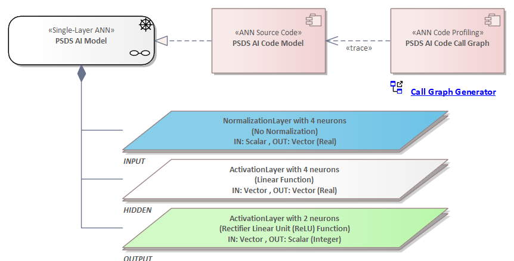

# _Platform Screen Door ANN (PSDS)_ - The ANN Architecture Model

_Quick Navigation:_ | [Introduction](index.md) | [Processes](processes.md) | [Methods](methods.md) | [Products](products.md) | [Examples](examples.md) | [Reference](quick-reference.md) | [Glossary](glossary.md) |

---

## ANN Layer Structure

## ANN Neuron Networking

## ANN Machine Learning

### ANN Learning Process

### ANN Learning Process - Detailed Workflow

#### Generate MAT Files

#### Train the ANN Model

#### Test the ANN Model

#### Save Model and Input Properties

---
_Quick Navigation:_ | [Introduction](index.md) | [Processes](processes.md) | [Methods](methods.md) | [Products](products.md) | [Examples](examples.md) | [Reference](quick-reference.md) | [Glossary](glossary.md) |
