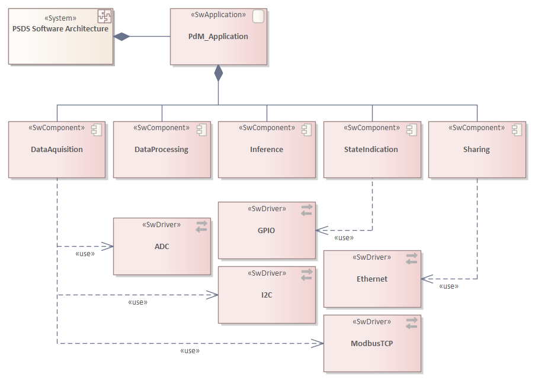

# _Platform Screen Door Software (PSDS)_ - The Software Architecture Model

_Quick Navigation:_ | [Introduction](index.md) | [Processes](processes.md) | [Methods](methods.md) | [Products](products.md) | [Examples](examples.md) | [Reference](quick-reference.md) | [Glossary](glossary.md) |

---

## Software Structure

## Software Applications

_Currently not available._

## Software Components

_Currently not available._

## Software Drivers

_Currently not available._

## Software Data Model

_Currently not available._

---
_Quick Navigation:_ | [Introduction](index.md) | [Processes](processes.md) | [Methods](methods.md) | [Products](products.md) | [Examples](examples.md) | [Reference](quick-reference.md) | [Glossary](glossary.md) |
