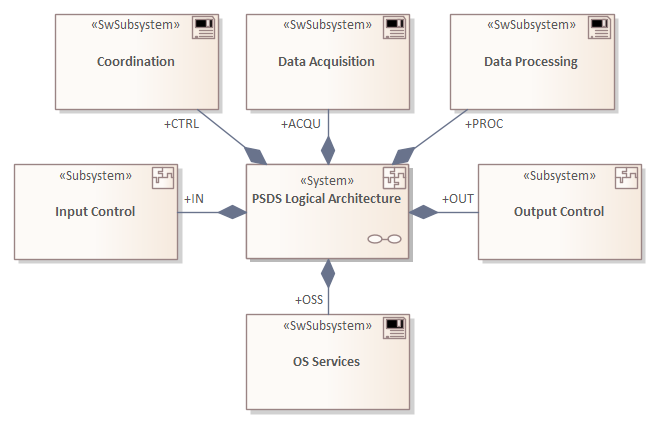
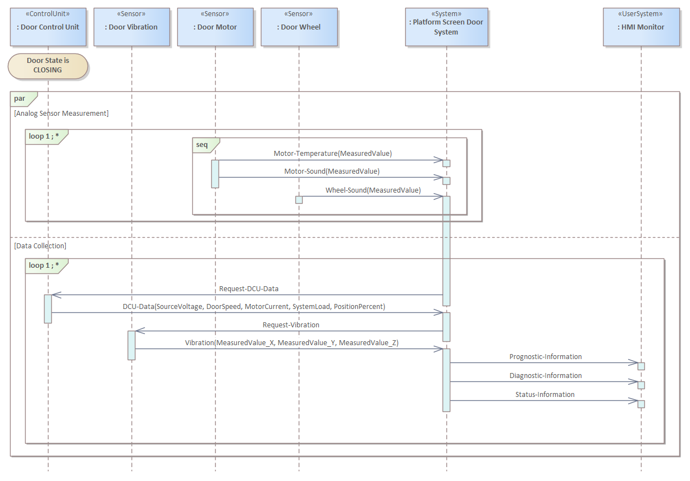

# _Platform Screen Door System (PSDS)_ - The System Architecture Model

## System Architecture Context

### Context Definition

### Context View

## System Architecture Decomposition

### Architecture Definition

### Architecture View

## System Modes

## System/Actor Interactions

#### Data Collection (Supported Door State)

#### System Startup (Base Path)

#### Switch to OPERATION Mode (Base Path)

#### Switch to FAILURE Mode (Base Path)

#### Switch to OFF Mode (Base Path)

## System Architecture Scenarios

### Data Collection (Supported Door State, Base Path)

#### System Startup (Base Path)

#### Switch to OPERATION Mode (Base Path)

#### Switch to FAILURE Mode (Base Path)

#### Switch to OFF Mode (Base Path)

---
_Quick Navigation:_ | [Introduction](index.md) | [Processes](processes.md) | [Methods](methods.md) | [Products](products.md) | [Examples](examples.md) | [Reference](quick-reference.md) | [Glossary](glossary.md) |
