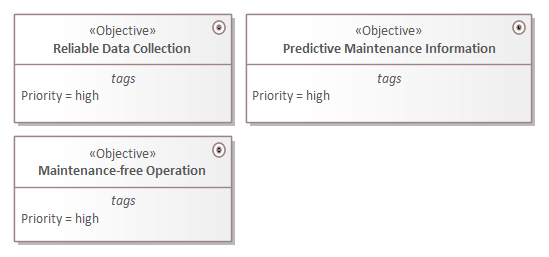
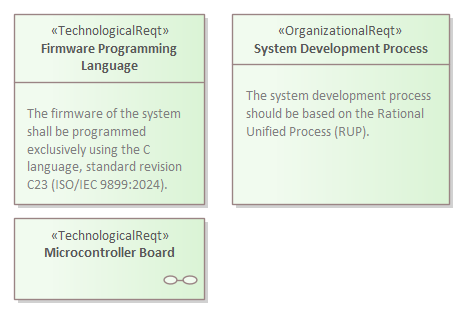
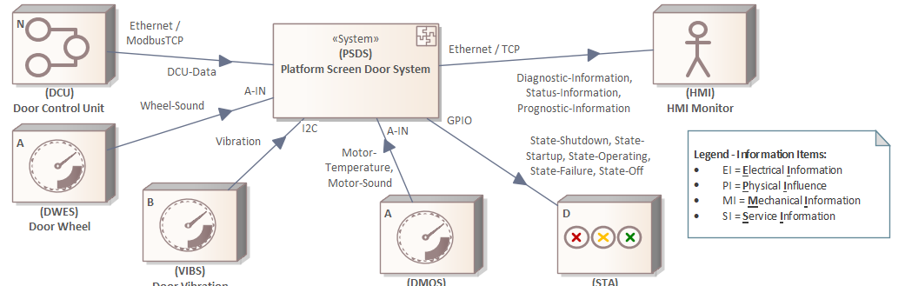
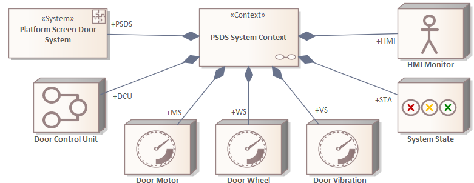
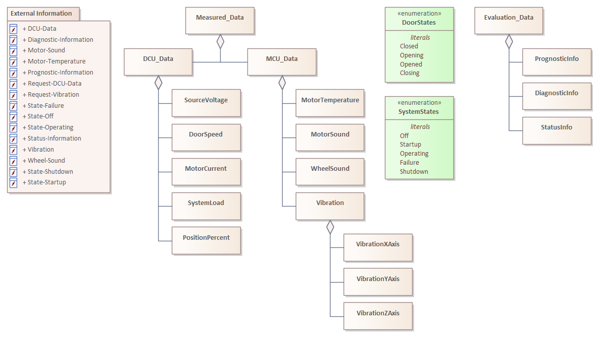

# _Platform Screen Door System (PSDS)_ - The System Requirements Model

## System Objectives

## Stakeholders

## System Requirements

### Functional System Requirements

### System Qualities

### System Constraints

## System Context

### Simple System Context

### Full System Context - Defintion

### Full System Context - View

## System Use Cases

### System Use Case _Collect Data_

#### Essential Description incl. Alternate/Exception Flows

#### Essential Steps

#### Details of _Request Door State_

#### Details of _Collect Measurement Data_

## System Processes

### System Process _Data Collection_

#### Details

## Domain Data Model

---
_Quick Navigation:_ | [Introduction](index.md) | [Processes](processes.md) | [Methods](methods.md) | [Products](products.md) | [Examples](examples.md) | [Reference](quick-reference.md) | [Glossary](glossary.md) |
