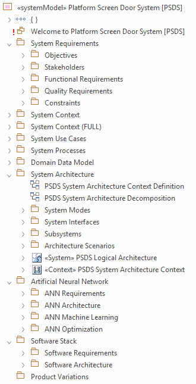

# The _Platform Screen Door System (PSDS)_ Example Project

_Please note, that the complete example project is available [here](models/ECOMOD_ExampleProject_PSDS.qea) as EA repository in the QEA format._

## The Model Structure

## System Requirements Model

+ [System Objectives](examples-00-system-requirements-model.md#system-objectives)
+ [Stakeholders](examples-00-system-requirements-model.md#stakeholders.md)
+ System Requirements:
  + [Functional System Requirements](examples-00-system-requirements-model.md#functional-system-requirements)
  + [System Qualities](examples-00-system-requirements-model.md#system-qualities)
  + [System Constraints](examples-00-system-requirements-model.md#system-constraints)
+ [System Context](examples-00-system-requirements-model.md#system-context)
+ [System Use Cases](examples-00-system-requirements-model.md#system-use-cases.md)
+ [Domain Information](examples-00-system-requirements-model.md#domain-information)

## System Architecture Model

+ [System Architecture Context](examples-00-system-architecture-model.md#system-architecture-context)
+ [System Decomposition](examples-00-system-architecture-model.md#system-architecture-decomposition)
+ [System Modes](examples-00-system-architecture-model.md#system-modes)
+ System Scenarios:
  + [System/Actor Interactions](examples-00-system-architecture-model.md#systemactor-interactions)
  + [Architecture Scenarios](examples-00-system-architecture-model.md#system-architecture-scenarios)

## Software Requirements Model

_Currently not available._

## Software Architecture Model

_Currently not available._

---
_Quick Navigation:_ | [Introduction](index.md) | [Processes](processes.md) | [Methods](methods.md) | [Products](products.md) | [Examples](examples.md) | [Reference](quick-reference.md) | [Glossary](glossary.md) |
