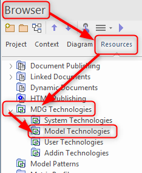
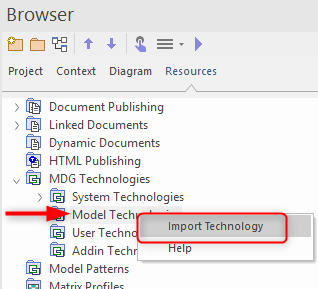
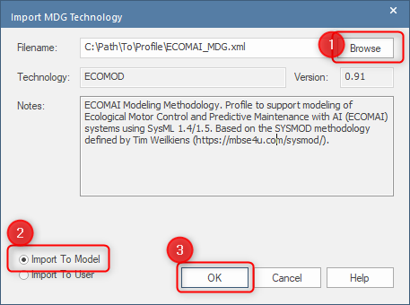

# ECOMOD Guidance: How to install the ECOMOD profile in Enterprise Architect

## Install ECOMOD Profile in Project Repository (recommended)

1. Create a new EA Repository or open an existing one.

2. Ensure that the EA's _Project Browser_ window is opened and visible.

3. Select the _Resources_ tab.

4. Expand the _MDG Technologies_ branch.

    

5. Open the context menu of the _Model Technologies_ sub-branch and select _Import Technology_ from the menu.

    

6. The _Import MDG Technology_ window will be opened:

    6.1. Use the _Browse_ button to select the ECOMOD profile on your computer system.

    6.2. Ensure that the _Import To Model_ option is selected.

    6.3. Press the _OK_ button to load and store the profile into your current repository.

    

## Other Installation Variants

The other variants to make a profile available in the Enterprise Architect are not recommended.
