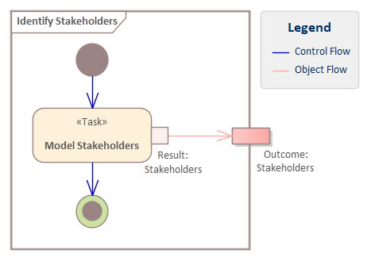

# ECOMOD Method: Identify Stakeholders

_Quick Navigation:_ | [Introduction](index.md) | [Processes](processes.md) | [Methods](methods.md) | [Products](products.md) | [Examples](examples.md) | [Reference](quick-reference.md) | [Glossary](glossary.md) |

---

Identify all persons and organizations that are interested in or effected by the system.

## Motivation

It is important to know all those persons and organizations that are interested in or effected by the system, together with their specific interests, needs, concerns or doubt, to specify proper requirements and build a system that satisfy those requirements.

## Description

### What's To Do

The list of stakeholders is initially elaborated in a workshop and continually reworked during the requirements analysis.

In order to be able to work effectively with the usually long list of _Stakeholders_, priorities must be assigned. For this purpose, ask the question _"How high is the risk that the project will fail if this stakeholder and thus his interests are not taken into account?"_ for each identified stakeholder and assign a **priority** (_critical, high, medium, low_) as an answer.  Additionally, note the **effort** (_high, medium, low_) to consider this stakeholder to enable a 2-dimensional priorization.

For complete documentation, at least the following informations about the stakeholder are required:
+ **Category**: Classification of a stakeholder into categories, for example _expert_, _requirements owner_, _system user_.
+ **Contact Person**: If we have a stakeholder who cannot be addressed directly (such as a customer), we need a contact person; for important contacts (_critical_ priority), deputies are also interesting.
+ **Department**: Which area does the stakeholder come from (_Business, IT_) or which area interests does he represent (_Requester, Implementer_)?

Each identified stakeholder is stored in the system model by using an ECOMOD stereotype that includes all the properties described above.

#### Guiding Questions

+ Who is interested in the system?
+ Who is affected if the system fails?
+ What if we don’t take this stakeholder and its interests into account?

### How To Do

The [_Stakeholders_](product_stakeholders.md) are depicted typically in a **SysML Requirements Diagram** and pictured with the **ECOMOD stereotype «Stakeholder»**.

If sensible, a stakeholder should be linked to the [_System Objectives_](product_system-objectives.md) by a directed relationship in order to know which stakeholder is interested in (or supports) which objective.

In a later step, each requirement shall be assigned to a stakeholder by using the "**Stakeholder**" property provided by the various **ECOMOD requirement stereotypes**.

### Next Steps

The [_Stakeholders_](product_stakeholders.md) are the source of [_Requirements_](product_system-requirements.md), which represents the specific interests and needs of the stakeholders.

## Inputs

_None._

## Outputs

+ [Stakeholders](product_stakeholders.md)

## Tasks

+ [Model Stakeholders](task_stakeholders.md)

## Further Information

### Recommendations & Tips

Typical Stakeholders are:

+ users of the system
+ customers, buyers of the system
+ board of directors, executive board
+ Legal, marketing, or sales department
+ legislators, standard organizations
+ service personnel, training personnel
+ project opponents, project supporters
+ stakeholders of supporting or related systems

---
_Quick Navigation:_ | [Introduction](index.md) | [Processes](processes.md) | [Methods](methods.md) | [Products](products.md) | [Examples](examples.md) | [Reference](quick-reference.md) | [Glossary](glossary.md) |
