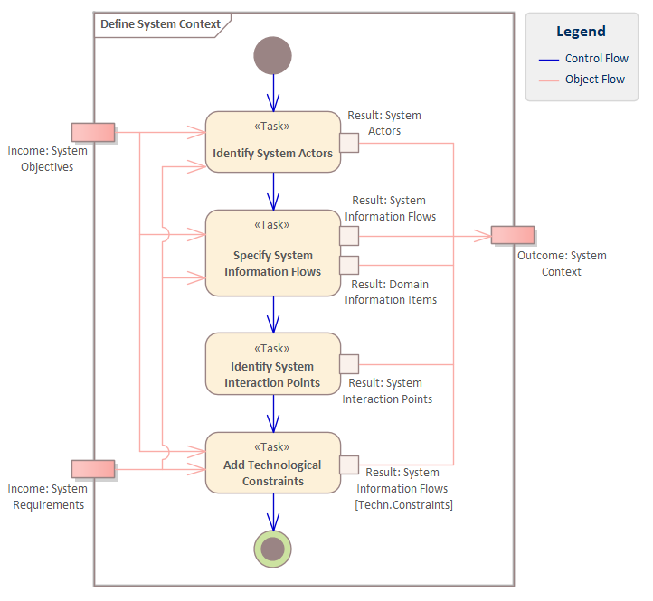

# ECOMOD Method: Define System Context

Identify the users and other external entities that interact with the system (or the system is acting with).

## Motivation

It's important to know those external entities with which the system interacts, together with the relevant information flows and the necessary system interactiion points.

## Description

### What's To Do

The _System Context_ represents all elements from the system's environment that are involved as partners in the interactions with the system. These elements are called _System Actors_. The obvious ones are the users of the system and the external systems with explicite interfaces. Less obvious _System Actors_, but equally important are, for example, environmental effects like temperature or humidity.

Besides the list of system actors the _System Context_ describes relevant flows of information items between the _System Actors_ and the system.

Please note, that the human actors and the humans and organizations behind the non-human actors are also _Stakeholders_ of the system.

#### Guiding Questions

+ Who or what interacts with the system?
+ Which information flows from the environment to the system?
+ Which information flows from the system to its environment?
+ What information items are exchanged during an interaction?
+ How does the system exchange information with its environment?
+ Which interaction paths with the actors can be brought together?

### How To Do

The [System Context](product_system-context.md) is depicted typically in a combination of two diagrams: a **SysML Block Definition Diagram** (definition of the types used in this context) and a **SysML Internal Block Diagram** (specification of the communication paths in this context between the system and the actors).

In the **SysML Block Definition Diagram** the context itself is pictured as **ECOMOD stereotype «Context»**, the system is pictured as **ECOMOD stereotype «System»** and the **System Actors** are pictured with specific **ECOMOD actor stereotypes** (e.g. a sensor actor as **ECOMOD stereotype «Sensor»**). The system and the actors are linked to the context by using the **SysML Part Association** relationship, having a role name noted at the source end of the link.

In the **SysML Internal Block Diagram** of the context all parts (system, actors) are pictured as specific **ECOMOD Property stereotypes** (e.g. system as **ECOMOD stereotype «SystemProperty»**, a sensor actor as **ECOMOD stereotype «SensorProperty»**). The identified _System Interaction Points_ (representing the system's interfaces to its environment on a higher level of consideration) are pictured as **SysML Port**.

The interaction between the system and an actor is expressed by a _Communication Path_ which is represented by the **SysML Connector** relationship. The exchange of information item is represented by **SysML InformationFlow** relationships, which is a directed link that has the conveyed information items (either **UML Signal** or **UML Class** elements) assigned.

Any technical constraints (which can be found in the _Functional System Requirements_ of kind _Interface Interactions_ or the _Technological Constraints_) should be noted on the _Communication Paths_ (e.g. as the link's name).

### Next Steps

The information flows are used to identify and describe the _System Use Cases_. The _System Architecture_ must reflect the information flows inside the system. The _System Interaction Points_ correspond to the _System Interfaces_ and are connected to the internal building blocks (_Subsystems_) of the system.

## Inputs

+ [System Objectives](product_system-objectives.md)
+ [System Requirements](product_system-requirements.md)

## Outputs

+ [System Context](product_system-context.md), consisting of:
  - System Actors
  - System Information Flows
  - System Interaction Points
+ [Domain Data Model](product_domain-data-model.md) (_updated_)

## Tasks

+ [Identify System Actors](task_system-actors.md)
+ [Specify System Information Flows](task_system-informationflows.md)
+ [Identify System Interaction Points](task_system-interactionpoints.md)
+ [Add Technological Constraints](task_system-commtechnologies.md)

## Further Information

### Recommendations & Tips

+ For a more precise indication of the nature of a _System Interaction Point_ the following prefixes could be used:
  + "EP_" for _**E**lectrical interaction **P**oint_ (e.g. EP_Sensor)
  + "MP_" for _**M**echanical interaction **P**oint_ (e.g. MP_Fastening)
  + "SP_" for _**S**ervice interaction **P**oint_ (e.g. SP_TaxCalculator)

+ For a more precise indication of the nature of an information item the following prefixes could be used:
  + "EI-" for _**E**lectrical **I**nformation_ (e.g. EI-Motor-Temperature)
  + "PI-" for _**P**hysical **I**nfluence_ (e.g. PI-Ambient-Temperature)
  + "MI-" for _**M**echanical **I**nformation_ (e.g. MI-Torque)
  + "SI-" for _**S**ervice **I**nformation_ (e.g. SI-Diagnostic-Data)
  
+ **Tip**: Use the '-' character instead of a '_' (underline) or ' ' (space) character in the information item's name.

---
_Quick Navigation:_ | [Introduction](index.md) | [Processes](processes.md) | [Methods](methods.md) | [Products](products.md) | [Examples](examples.md) | [Reference](quick-reference.md) | [Glossary](glossary.md) |
