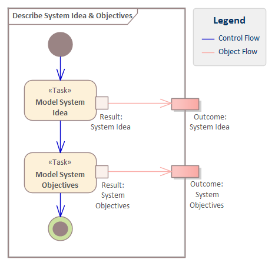

# ECOMOD Method: Model System Idea & Objectives

_Quick Navigation:_ | [Introduction](index.md) | [Processes](processes.md) | [Methods](methods.md) | [Products](products.md) | [Examples](examples.md) | [Reference](quick-reference.md) | [Glossary](glossary.md) |

---

Describe the base idea and purpose of the system, and the goals of the system development in a short and readable form.

## Motivation

The [_System Idea_](product_system-idea.md) and the [_System Objectives_](product_system-objectives.md) must be known to everyone who is involved in the system development so that the right decisions are made on the way to the finished system. If you don't know the goals of the system development, but all the rules of your perfect development process, you will reach a solution that probably does not match your requirements.

## Description

### What's To Do

Create a brief description of the base idea and purpose of the system, including an enumeration of its core features, and the goals of the system development.

Both, the [_System Idea_](product_system-idea.md) and [_System Objectives_](product_system-objectives.md) must be part of the system model to communicate them and to link them with system artefacts like _Requirements_ or _Stakeholders_. Such a relationship could be directly or indirectly, for example, a requirement could be traced to another requirement that directly amplifies an objective.

#### Guiding Questions

+ How can the system be introduced in 5 minutes?
+ What we are building and why we are doing this?
+ What is the value for the user of the system?
+ What are the goals of the system development?
+ What goals does the project *not* pursue, what are the so-called non-goals?

### How To Do

The [_System Idea_](product_system-idea.md) is stored in the system model as a text in a property "**SystemIdea**", provided by the **ECOMOD stereotype «System»** which represents the system itself.

The [_System Objectives_](product_system-objectives.md) are depicted typically in a **SysML Requirements Diagram** and pictured with the **ECOMOD stereotype «Objective»**.

In a later step, the [_Requirements_](product_requirements.md) should by linked to the [_System Objectives_](product_system-objectives.md) by a directed relationship in order to make it possible to understand which requirements support the achievement of which objective.
Further, the [_Stakeholders_](product_stakeholders.md) should be linked to the [_System Objectives_](product_system-objectives.md) by a directed relationship in order to know which stakeholder is interested in (or supports) which objective.

### Next Steps

The [_System Idea_](product_system-idea.md) and the [_System Objectives_](product_system-objectives.md) are part of the basic knowledge for all subsequent steps and have to be communicated to everyone who is involved in the system development.

## Inputs

_None._

## Outputs

+ [System Idea](product_system-idea.md)
+ [System Objectives](product_system-objectives.md)

## Tasks

+ [Model System Idea](task_system-idea.md)
+ [Model System Objectives](task_system-objectives.md)

## Further Information

### Recommendations & Tips

_None._

---
_Quick Navigation:_ | [Introduction](index.md) | [Processes](processes.md) | [Methods](methods.md) | [Products](products.md) | [Examples](examples.md) | [Reference](quick-reference.md) | [Glossary](glossary.md) |
