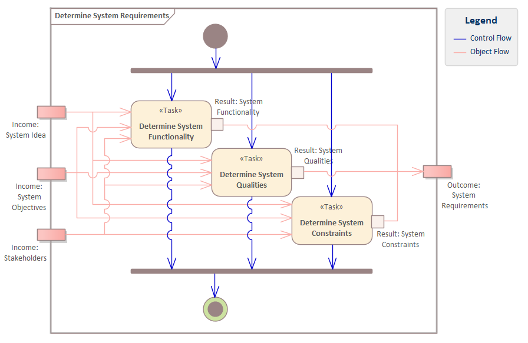

# ECOMOD Method: Model System Requirements

Document the functional and non-functional properties and constraints that have to be satisfied by the system.

## Motivation

It's important to know the features of the system and what the system has to do. Requirements, which are functional and non-functional properties and constraints, represent the contract between the _Stakeholders_ and the system engineers about the goals of the system development.

## Description

### What's To Do

Document all the functional and non-functional properties and constraints that specify what the system has to do. 
Depending on the level of abstraction covered by the system model, the requirements could include either only stakeholder (user) requirements or only system requirements, or both.

Basically, the identified _Stakeholders_ are the source of the requirements, representing the concerns and wishes of the _Stakeholders_ on a more rough level. Those requirements are usually imported into a system model as "surrogates" to serve as a starting point for the more detailed _System Requirements_. The idea behind it is that if a customer request changes, its impact on the _System Requirements_, which form the basis for system development, can be assessed.

For a complete documentation the following information about a requirement are required:
+ the **stability** of the requirement (_instable, stable_)
+ the **obligation** for implementation (_must-have, should-have, nice-to-have_)
+ the **priority** for implementation (_high, medium, low_)
+ an estimated **effort** for implementation (_high, medium, low_)
+ the **motivation** behind the requirement from the requester's perspective
+ the **risks** if the requirement is _not_ implemented

Each identified requirement is stored in the system model by using an ECOMOD stereotype that includes all the properties described above.

#### Guiding Questions

+ Which system function must be offered by the system?
+ Which qualities must be satisfied by the system?
+ Which interfaces must be offered or supported by the system?
+ What are the constraints (physical, technological) that limit the solution space?
+ Which regulatory constraints must be satisfied by the system?

### How To Do

The [System Requirements](product_system-requirements.md) are depicted typically in a **SysML Requirements Diagram** and pictured with one of the various **ECOMOD requirements stereotypes**:

+ A _Functional Requirement_ is pictured with the **ECOMOD stereotype «FunctionalReqt»**.
+ A _Quality Requirement_ is pictured - depending on the FURPS+ categories - with the **ECOMOD stereotype «FunctionalityReqt»**, **ECOMOD stereotype «UsabilityReqt»**, **ECOMOD stereotype «ReliabilityReqt»**, , **ECOMOD stereotype «PerformanceReqt»**, **ECOMOD stereotype «SupportabilityReqt»**, or **ECOMOD stereotype «SecurityReqt»**.
+ A _Constraint_ is pictured - depending on their kind - with the **ECOMOD stereotype «TechnologicalReqt»**, **ECOMOD stereotype «OrganizationalReqt»**, or **ECOMOD stereotype «RegulatoryReqt»**.

Each requirement is assigned to a _Stakeholder_ by using the "**Stakeholder**" property provided by the **ECOMOD requirements stereotypes** (_note: an explicite linkage using a relationship is not necessary_).

Dependencies between requirements can be documented by using the various requirements relationships provided by SysML.

If sensible, requirements should be linked to the [_System Objectives_](product_system-objectives.md) in order to know which requirement "realizes" or supports which objective. Such relations should be pictured with the **SysML Trace** relationship.

### Next Steps

The _System Requirements_ are direct or indirect input information for most steps of system development.

## Inputs

+ [System Idea](product_system-idea.md)
+ [System Objectives](product_system-objectives.md)
+ [Stakeholders](product_stakeholders.md)

## Outputs

+ [System Requirements](product_system-requirements.md), consisting of:
  + System Functionality
  + System Qualities
  + System Constraints

## Tasks

+ [Determine System Functionality](task_system-funcreqts.md)
+ [Determine System Quality](task_system-qualities.md)
+ [Determine System Constraint](task_system-constraints.md)

## Further Information

### Recommendations & Tips

_None._

---
_Quick Navigation:_ | [Introduction](index.md) | [Processes](processes.md) | [Methods](methods.md) | [Products](products.md) | [Examples](examples.md) | [Reference](quick-reference.md) | [Glossary](glossary.md) |
