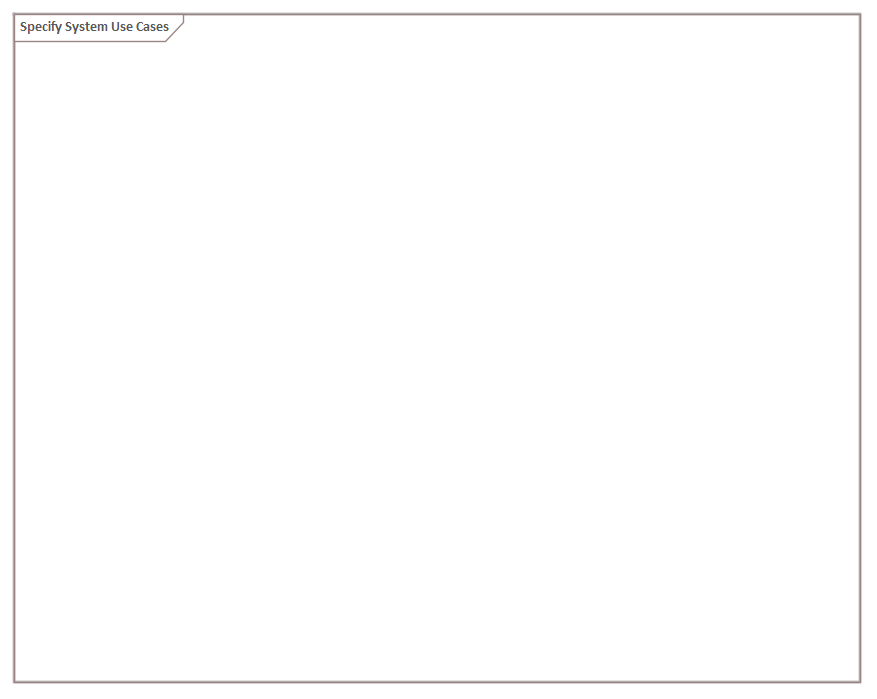

# ECOMOD Method: Model System Use Cases

Identify all services of the system that are provided to the system actors.

## Purpose

The System Use Cases are the services and the essential ends of a system. The system is developed and operated to achieve these services.

?????????????

Consists of an essential description and a formal specificaton ([Use Case Activities](product_system-usecaseactivities.md))

SUCs linked to FuncReqt, UCActs (and their Actions) linked to Constraints and Qualities

Preparation => essential description
Detailed => formal specificaton

?????????????

## Description

#### ---ORIGINAL---begin---
The System Use Cases provide an outside-in view on the system functions from the perspective of the system actors (_"What does the system for me?"_). That enables the system development to build a system that really satisfies the needs of the system actors.
An inside-out perspective on the functional Requirements of a system also enables that all functions will be considered by the system, but with the risk that they do not consider the usability needs of the users.
#### ---ORIGINAL---end---

A System Use Case should be described by at least

+ the trigger that starts the use case,
+ the result of the use case,
+ the associated system actors,
+ a brief textual description (_2-5 sentences_),
+ the pre- and postconditions,
+ traceable paths to the relevant customer requests, constraints and product qualities,
+ the essential steps to be executed to fulfill the purpose of the use case.

Typically, for each identified system use case exists a so-called _Use Case Activity_ that describes its workflow in detail (including the essential object flows) in a formal kind. Such an activity can be seen as a formal specified functional system requirement.

## Inputs

+ [System Requirements](product_system-requirements.md)
+ System Context: [simple](product_system-context-simple.md) or [complex](product_system-context.md)

## Outputs

+ [System Use Cases](product_system-usecases.md)

## Tasks

+ -TODO- [Identify Use Cases](task_usecases.md)
+ -TODO- [Describe Use Case Essentials](task_usecase-essentials.md)

## Further Information

### Recommendations & Tips

_None._

---
_Quick Navigation:_ | [Introduction](index.md) | [Processes](processes.md) | [Methods](methods.md) | [Products](products.md) | [Examples](examples.md) | [Reference](quick-reference.md) | [Glossary](glossary.md) |
