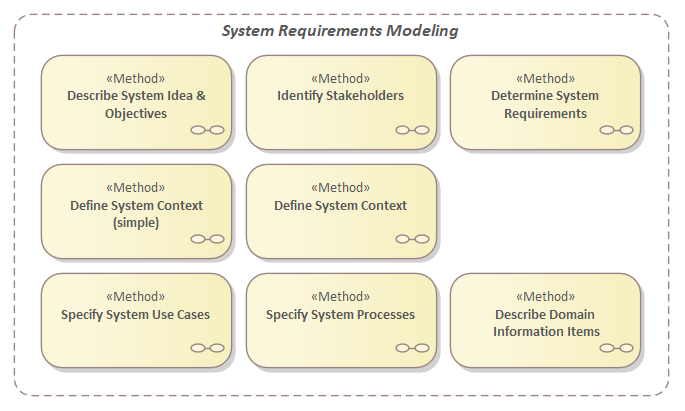
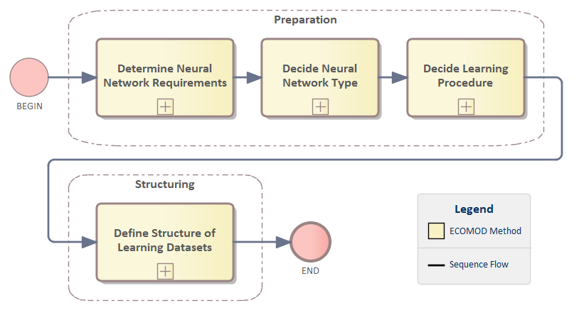
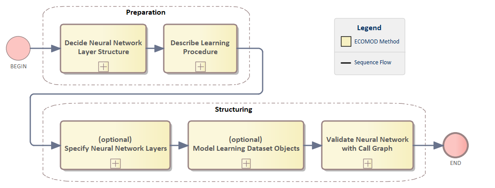
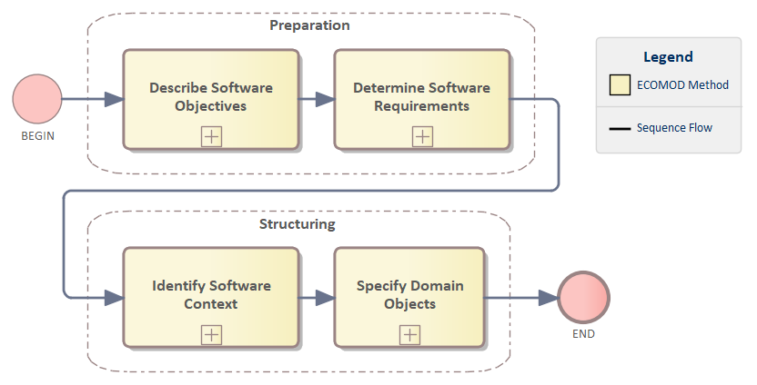
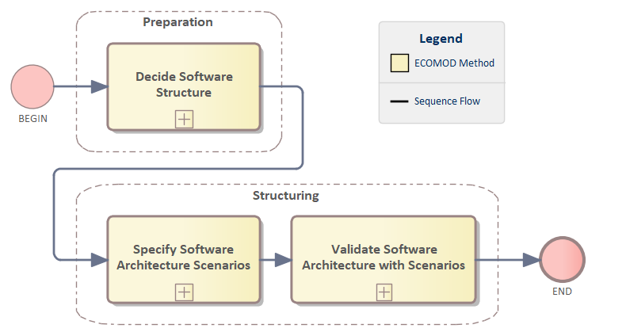

# The ECOMOD Methods

_Quick Navigation:_ | [Introduction](index.md) | [Processes](processes.md) | [Methods](methods.md) | [Products](products.md) | [Examples](examples.md) | [Reference](quick-reference.md) | [Glossary](glossary.md) |

---

The **_ECOMOD Methods_** listed below are in a logical order according to the levels of consideration.

## System Level

### Context: System Requirements Model

+ [Describe System Idea & Objectives](method_system-idea-objectives.md)

+ [Identify Stakeholders](method_stakeholders.md)

+ [Determine System Requirements](method_system-requirements.md)

+ Define System Context:
  + [Define System Context (_simple variant_)](method_system-context-simple.md)
  + [Define System Context](method_system-context.md)

+ [Specify System Use Cases](method_system-usecases.md)

+ [Specify System Processes](method_system-processes.md)

+ [Specify Use Case Activities](method_system-usecases-activities.md)

+ [Describe Domain Data](method_domain-data-model.md)

---
### Context: System Architecture Model

+ [Specify System/Actor Interactions](method_system-interactions.md)

+ [Decide System Structure](method_system-architecture.md)

+ [Specify System Architecture Scenarios](method_system-scenarios.md)

+ [Validate System Architecture with Scenarios](method_system-architecture-validation.md)

+ [Describe System Modes](method_system-modes.md)

---
## Artificial Neural Network Level

### Context: _Artificial Neural Network Requirements Process_

+ Decide Neural Network Requirements

+ Decide Neural Network Type

+ Decide Learning Procedure

+ Define Structure of Learning Datasets

---
### Context: _Artificial Neural Network Architecture Process_

+ Decide Neural Network Layer Structure

+ Describe Learning Procedure

+ Specify Neural Network Layers

+ Model Learning Dataset Objects

+ Validate Neural Network with Call Graph

---
## Software Level

### Context: _Software Requirements Process_

+ Describe Software Objectives

+ Determine Software Requirements

+ Identify Software Context

+ Specify Domain Objects

---
### Context: _Software Architecture Process_

+ Decide Software Structure

+ Specify Software Architecture Scenarios

+ Validate Software Architecture with Scenarios

---
_Quick Navigation:_ | [Introduction](index.md) | [Processes](processes.md) | [Methods](methods.md) | [Products](products.md) | [Examples](examples.md) | [Reference](quick-reference.md) | [Glossary](glossary.md) |
