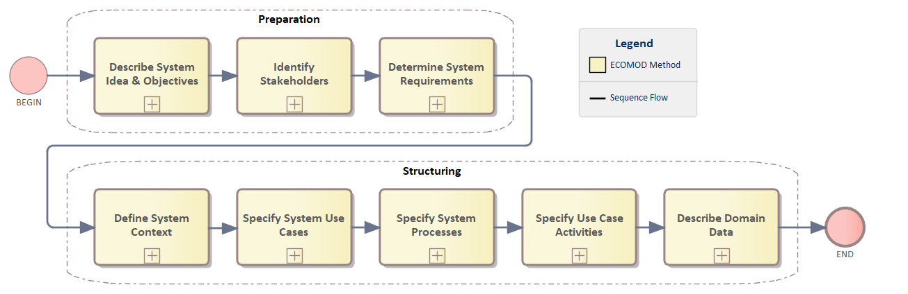
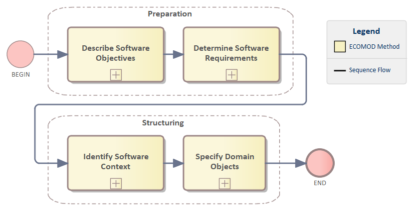
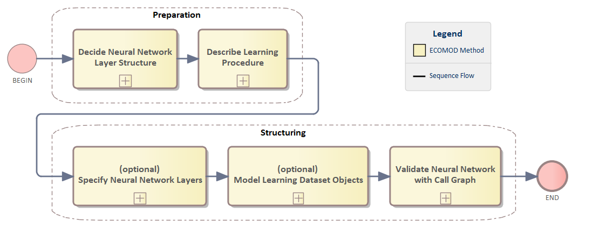

# The ECOMOD Process Model

_Quick Navigation:_ | [Introduction](index.md) | [Processes](processes.md) | [Methods](methods.md) | [Products](products.md) | [Examples](examples.md) | [Reference](quick-reference.md) | [Glossary](glossary.md) |

---

The **_ECOMOD Process Model_** presented here is a description of only one of the possible and logically sensible execution sequences of the [ECOMOD Methods](methods.md). The order and selection of methods can be different in each project.

In particular, the logical order and the timely order should not mix up! The logical order does not imply a waterfall process. The _ECOMOD Process Model_ is independent of a waterfall or agile approach.

The _ECOMOD Process Model_ defines the two basic kinds of process: **Requirements** and **Architecture**.

The goal of a _Requirements_ process is collect all relevant requirements (objectives, functionalities, qualities and constraints) of the belonging level and provide them as the base to evolve a solution, which is the goal of an _Architecture_ process.

Further, each kind of process is devided into two phases: **Preparation** and **Structuring**.

The goal of the _Preparation_ is to know and understand all relevant objectives, required functionality, qualities expected and constraints. 
Based on this knowledge, we are able to decide on a suitable solution and specify the requirements, architectural decisions and solution structure more precisely in a formal specification, which is the goal of _Structuring_.

Regarding to the consideration on different levels the following concrete processes result:

+ **System** Level:

  + [System Requirements](#system-requirements)

  + [System Architecture](#system-architecture)

+ **Software** Level:

  + [Software Requirements](#software-requirements)

  + [Software Architecture](#software-architecture)

+ **Artificial Neural Network** Level:

  + [Artificial Neural Network Requirements](#artificial-neural-network-requirements)

  + [Artificial Neural Network Architecture](#artificial-neural-network-architecture)

**It's important to start a system's consideration at _System Level_!**
Performing the processes [System Requirements](#system-requirements) and [System Architecture](#system-architecture) ensures that the requirements and architecture of the overall system have been sufficiently considered **before** the implementation of the software is started.

_Please note, that the processes presented here are only a description of one useful logical order of execution of the [ECOMOD Methods](methods.md). The order and selection of the methods will be different in each project._

## System Requirements

#### Necessary Inputs:

_-none-_

#### Produced Outcomes:

+ [System Idea](product_system-idea.md)
+ [System Objectives](product_system-objectives.md)
+ [Stakeholders](product_stakeholders.md)
+ [System Requirements](product_system-requirements.md)
+ System Context:
  + [System Context (_simple variant_)](product_system-context-simple.md)
  + [System Context](product_system-context.md)
+ [System Use Cases](product_system-usecases.md)
+ [System Use Case Activities](product_system-usecaseactivities.md)
+ [System Processes](product_system-processes.md)
+ [Domain Data Model](product_domain-data-model.md)

#### Applied Methods:

+ [Identify Stakeholders](method_stakeholders.md)
+ [Describe System Idea & Objectives](method_system-idea-objectives.md)
+ [Model Requirements](method_system-requirements.md)
+ [Identify System Context](method_system-context.md)
+ [Identify System Use Cases](method_system-usecases.md)
+ [Identify System Processes](method_system-processes.md)
+ [Model Use Cases Activities](method_system-usecases-activities.md)
+ [Model Domain Knowledge](method_domain-data-model.md)

## System Architecture

#### Necessary Inputs:

+ System Context ([_simple variant_](product_system-context-simple.md) or [complex](product_system-context.md))
+ [System Requirements](product_system-requirements.md)
+ [System Use Cases](product_system-usecases.md)
+ [Domain Data Model](product_domain-data-model.md)

#### Produced Outcomes:

+ [System Structure](product_system-architecture.md)
+ [System/Actor Interactions](product_system-interactions.md)
+ [System Architecture Scenarios](product_system-scenarios.md)
+ [System Modes](product_system-modes.md)

#### Applied Methods:

+ [Specify System/Actor Interactions](method_system-interactions.md)
+ [Decide System Structure](method_system-architecture.md)
+ [Specify System Architecture Scenarios](method_system-scenarios.md)
+ [Validate System Architecture with Scenarios](method_system-architecture-validation.md)
+ [Describe System Modes](method_system-modes.md)

## Software Requirements

### COMING SOON - STAY TUNED! ###

## Software Architecture

### COMING SOON - STAY TUNED! ###

## Artificial Neural Network Requirements

### COMING SOON - STAY TUNED! ###

## Artificial Neural Network Architecture

### COMING SOON - STAY TUNED! ###

---
_Quick Navigation:_ | [Introduction](index.md) | [Processes](processes.md) | [Methods](methods.md) | [Products](products.md) | [Examples](examples.md) | [Reference](quick-reference.md) | [Glossary](glossary.md) |
