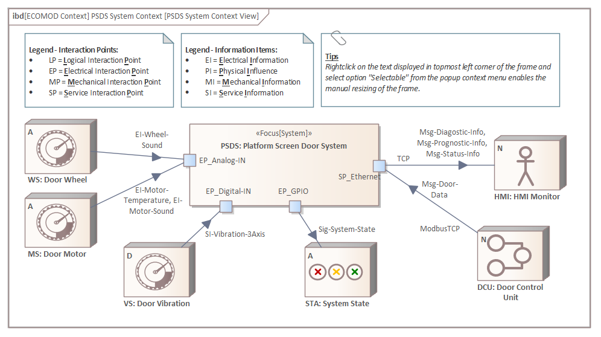
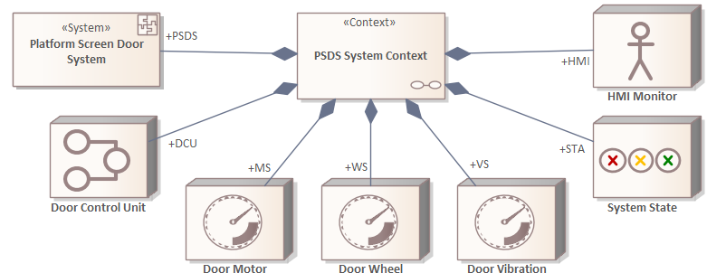

# ECOMOD Product: System Context

The **_System Context_** lists the external entities that interact with the system.

## Purpose

The **_System Context_** depicts how the system is embedded in its environment. It shows the external entities and the communication links between the system and those entities, together with the relevant item flows and the necessary system interfaces.

The **_System Context_** provides answers to the following primary questions about the system model:

+ What is the name of the system of interest?
+ What is part of the system environment (and therefore not part of the system itself)?
+ Which external entities play a role in the context of the system of interest?

The **_System Context_** can also provide answers to other questions:

+ Which external entity delivers which information to system of interest?
+ Which external entity receives which information from system of interest?
+ Which protocols are used to communicate with the external entities?
+ Which interaction points are used to communicate with the external entities?
+ Which interface technologies are used to communicate with the external entities?

## Description

The system provides functions to and requests functions from the external entities, and handles events and effects from the outside. It is essential to know the complete context of the system. Therefore the **_System Context_** is a mandatory part of the systems model, representing a black-box view on the system that delimits the system itself from its environment.

The **_System Context_** is a list of the external entities and the relevant item flows between the system and those entities. The external entities are called _System Actors_ and can be categorized basically as human user, environmental effects and external devices or systems. The communication endpoints on system-side are called _System Interaction Points_ and represents the system's interfaces to its environment on a higher level of consideration.

## Representation

The _System Context_ is depicted typically in a combination of a **SysML Block Definition Diagram** and a **SysML Internal Block Diagram**.

In the **SysML Block Definition Diagram** the "_types used in the context_" are defined: the system context itself is pictured as **ECOMOD stereotype «Context»**, the system is pictured as **ECOMOD stereotype «System»** and the **System Actors** are pictured with specific **ECOMOD actor stereotypes** (which represents the actor concept, but are specialized **SysML Blocks**); the system and the actors are linked to the context by using the **SysML Part Association** relationship.

In the **SysML Internal Block Diagram** of the system context all parts (system, actors) are pictured as specific **ECOMOD Property stereotypes** (e.g. system as **ECOMOD stereotype «SystemProperty»**). The _System Interaction Points_ (representing the system interfaces on a higher level) of the system are pictured as **SysML Port**.

The communication links between the parts are pictured as **SysML Connector** relationships, the item flows as directed **SysML InformationFlow** relationships, and the information items itself are pictured with **UML Class** or **UML Signal** elements.

## Further Information

+ This product is produced by the methods:
  - [Define System Context](method_system-context.md)

+ This product is used as input by the methods:
  - [Specify System Use Cases](method_system-usecases.md)
  - [Specify System Processes](method_system-processes.md)
  - [Describe Domain Information Items](method_system-domainentities.md)
  - [Specify System/Actor Interactions](method_system-interactions.md)
  - [Decide System Interfaces](method_system-interfaces.md)
  - [Decide System Structure](method_system-decomposition.md)

## Examples

#### System Context (View)

#### System Context (Definition)

---
_Quick Navigation:_ | [Introduction](index.md) | [Processes](processes.md) | [Methods](methods.md) | [Products](products.md) | [Examples](examples.md) | [Reference](quick-reference.md) | [Glossary](glossary.md) |
