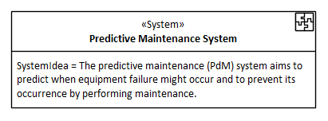

# ECOMOD Product: System Idea

The **_System Idea_** describes the core idea behind the system and lists the core feature of the system.

## Purpose

The **_System Idea_** provides a brief description of the purpose of the system for everyone involved in the project.

## Description

The **_System Idea_** is a short description (_in 1-3 sentences_) of the core idea and purpose of the system, including an enumeration of its core features.

The **_System Idea_** provides answers to the following primary questions about the system model:

+ What we are building?
+ Why we are doing this?

The **_System Idea_** can also provide answers to other questions:

+ What is the value for the user of the system?

## Representation

The **_System Idea_** is a simply text stored in the property "_SystemIdea_" of the **ECOMOD stereotype «System»**.

## Further Information

+ This product is produced by the methods:
  - [Model System Idea & Objectives](method_system-idea-objectives.md)

+ This product is used as input by the methods:
  - [Model Stakeholder Requirements](method_stakeholder-requirements.md)
  - [Model System Constraints](method_system-constraints.md)
  - [Model System Qualities](method_system-qualitycriterias.md)
  - [Model System Use Cases](method_system-usecases.md)
  - [Model System Processes](method_system-processes.md)

## Examples

---
_Quick Navigation:_ | [Introduction](index.md) | [Processes](processes.md) | [Methods](methods.md) | [Products](products.md) | [Examples](examples.md) | [Reference](quick-reference.md) | [Glossary](glossary.md) |
