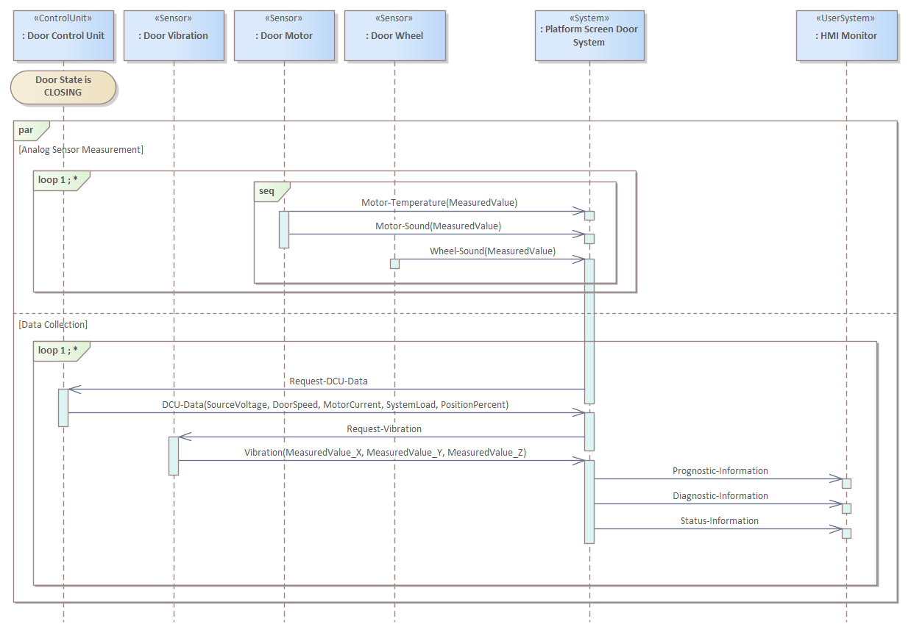

# ECOMOD Product: System/Actor Interactions

The **_System/Actor Interactions_** describes the collaborations of the system with its environment.

## Purpose

The **_System/Actor Interactions_** specifies the interactions between the system and the _System Actors_, related to an use case.

## Description

An _Use Case Interaction_ describes for a single path through a system function (a _use case scenario_) the interactions between the system and those _System Actors_ that are involved in this scenario. An _Use Case Interaction_ provides a template for the design, specifically for defining the system interfaces.

The **_System/Actor Interactions_** provides answers to the following primary questions about the system model:

+ Which system actors are needed in execution of an use case?
+ What requests do actors send to the system during an use case execution?
+ What requests does the system send to actors during an use case execution?

The **_System/Actor Interactions_** can also provide answers to other questions:

+ Which information are exchanged during an use case execution?
+ Who carries out which request and when?

The ECOMOD product **_System/Actor Interactions_** is part of the ECOMOD product [_System Use Cases_](product_system-usecases.md) and should provide for each use case defined in the system model at least a specification of its base-path scenario.

## Representation

The interactions done in an _Use Case Interaction_ are depicted in a **SysML Sequence Diagram**. The partners involved in that interactions are pictured as classified **SysML Lifelines**, the interactions itself are pictured as a sequence of **SysML Messages**.

## Further Information

+ This product is produced by the methods:
  - [Specify System/Actor Interactions](method_system-interactions.md)

+ This product is used as input by the methods:
  - [Specify Architecture Scenarios](method_system-scenarios.md)

## Examples

#### Scenarios

---
_Quick Navigation:_ | [Introduction](index.md) | [Processes](processes.md) | [Methods](methods.md) | [Products](products.md) | [Examples](examples.md) | [Reference](quick-reference.md) | [Glossary](glossary.md) |
