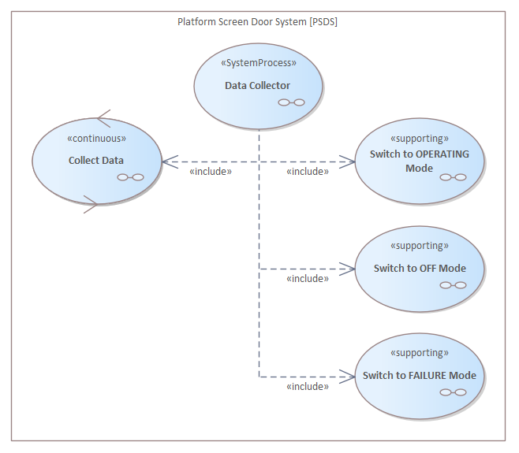
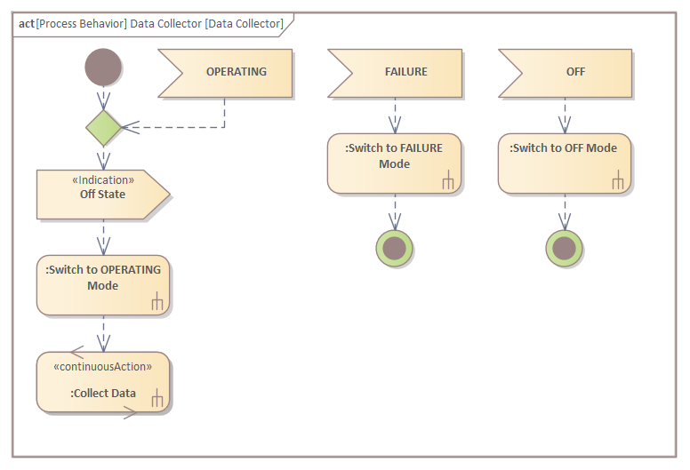

# ECOMOD Product: System Processes

The **_System Processes_** specify the execution of the _System Use Cases_ in a logical order.

## Purpose

The **_System Processes_** describe the usage of the system on a higher level than the System Use Cases.

## Description

#### ---ORIGINAL---begin---
The _System Process_ is a process description on a higher level than the _System Use Cases_. For example, the process from installation and setup via some operational functions to shutdown and deinstallation. Typically, a System Process is a flow-oriented behavior, i.e. it describes the logical order of the _System Use Cases_.

Alternatively, a System Process could also describe event-oriented behavior in form of a state machine.

A System Process is a special use case with flow- or event-oriented behavior.
#### ---ORIGINAL---end---

The **_System Processes_** provides answers to the following primary questions about the system model:

+ What is the logical execution order of the system use cases?

## Representation

The _System Processes_ are depicted in a **SysML Use Case Diagram** and pictured as **ECOMOD stereotype «SystemProcess»**. The linking between a _System Process_ and an inbound _System Use Case_ is pictured either with the **SysML Inclusion** or **SysML Extension** relationship.

 The behavior of a _System Process_ is depicted either in a **SysML Activity Diagram** or **SysML State Diagram**.

## Further Information

+ This product is produced by the methods:
  - [Identify System Processes](method_system-processes.md)

+ This product is used as input by the methods:
  - _-none-_

## Examples

#### System Process Activity Specification: _Data Collection_

---
_Quick Navigation:_ | [Introduction](index.md) | [Processes](processes.md) | [Methods](methods.md) | [Products](products.md) | [Examples](examples.md) | [Reference](quick-reference.md) | [Glossary](glossary.md) |
