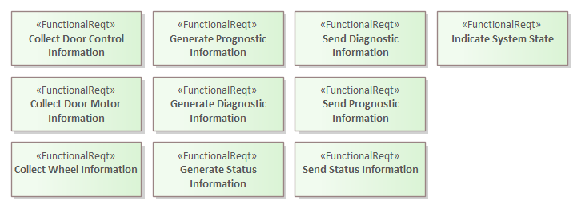
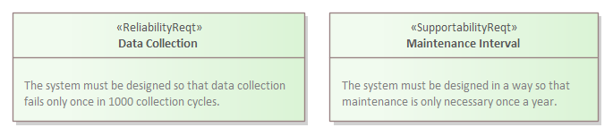

# ECOMOD Product: System Requirements

The **_System Requirements_** describes properties or constraints that have to be satisfied by the system.

## Purpose

The **_System Requirements_** represents the contract between the _Stakeholders_ and the system engineers.

## Description

The **_System Requirements_** lists the functional and non-functional properties and constraints that have to be satisfied by the system solution. Typically, requirements are informal and text-based. The ECOMOD profile supports this with specific elements.

The ECOMOD profile supports the modelling of informal and text-based requirements through specific elements that are classified into the following types:
+ _Functional Requirements_, representing the expected functionality of the solution, and
+ _Quality Requirements_, representing the expected quality of the solution, and
+ _Constraints_, delimiting the solution space and the development process.

The **_System Requirements_** provides answers to the following primary questions about the system model:

+ Which system function must be offered by the system?
+ Which qualities must be satisfied by the system?
+ Which interfaces must be offered or supported by the system?
+ What are the constraints that limit the solution space?

The **_System Requirements_** can also provide answers to other questions:

+ Which qualities influence which functional requirements?
+ What restrictions must be taken into account when developing a system solution?
+ What physical requirements must be satisfied by the system?
+ What technological requirements must be satisfied by the system?
+ What architectural requirements must be satisfied by the system?
+ What regulatory requirements must be satisfied by the system?

The **_System Requirements_** should have traceable relationships with those _Stakeholders_ which are the source of information of them. They should also have traceable relationships with those _System Objectives_ which are satisfied by them.

## Representation

The **_System Requirements_** are depicted typically in a **SysML Requirements Diagram**.

_Functional Requirements_ are pictured using the **ECOMOD stereotype «FunctionalReqt»**.

_Quality Requirements_ depend on the FURPS+ categories and are pictured using the **ECOMOD stereotype «FunctionalityReqt»**, **ECOMOD stereotype «UsabilityReqt»**, **ECOMOD stereotype «ReliabilityReqt»**, , **ECOMOD stereotype «PerformanceReqt»**, **ECOMOD stereotype «SupportabilityReqt»**, or **ECOMOD stereotype «SecurityReqt»**.

_Constraints_ are pictured using - depending on their kind - the **ECOMOD stereotype «TechnologicalReqt»**, **ECOMOD stereotype «OrganizationalReqt»**, or **ECOMOD stereotype «RegulatoryReqt»**.

The linking between **_System Requirements_** and _System Objectives_ are pictured with the **SysML Trace** relationship.

## Further Information

+ This product is produced by the methods:
  - [Determine System Requirements](method_system-requirements.md)

+ This product is used as input by the methods:
  - [Define System Context](method_system-context.md)
  - [Specify System Use Cases](method_system-usecases.md)
  - [Specify System Processes](method_system-processes.md)
  - [Specify System/Actor Interactions](method_system-interactions.md)
  - [Decide System Interfaces](method_system-interfaces.md)
  - [Decide System Structure](method_system-decomposition.md)

## Examples

#### Functional System Requirements

#### System Quality Requirements

#### System Constraints

---
_Quick Navigation:_ | [Introduction](index.md) | [Processes](processes.md) | [Methods](methods.md) | [Products](products.md) | [Examples](examples.md) | [Reference](quick-reference.md) | [Glossary](glossary.md) |
