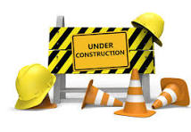

# ECOMOD Product: System System Architecture Scenarios

The **_System Architecture Scenarios_** describe concrete collaborations of _System Actors_ and system parts to perform a system function.

### COMING SOON - STAY TUNED! ###

---
_Quick Navigation:_ | [Introduction](index.md) | [Processes](processes.md) | [Methods](methods.md) | [Products](products.md) | [Examples](examples.md) | [Reference](quick-reference.md) | [Glossary](glossary.md) |
