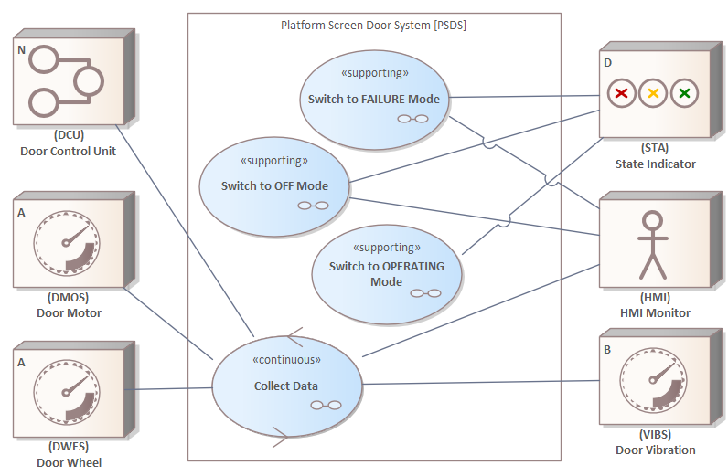

# ECOMOD Product: System Use Cases

The **_System Use Cases_** lists the services provided by the system to the entities in its environment.

## Purpose

The **_System Use Cases_** provide a view on the system from a functional viewpoint und lists the system functions from the perspective of the System Actors to enable an optimized development of the requirements and the systems usability.

## Description

A _System Use Case_ is typically triggered by a _System Actor_ and returns a result that is of value for actors or stakeholders of the system. The behavior is timely cohesive, i.e. there is no timely interruption supported by the system.

--begin--
Im Kontext eines autonom ablaufenden Systems ist ein System Use Case eine wesentliche Systemfunktion, die *nicht* durch einen Systemakteur, sondern durch einen internen Auslöser (Ereignis, Aufruf) aktiviert wird.
--end--

An use case is described by
+ a brief textual description (_2-5 sentences_),
+ the trigger that starts the function,
+ the associated system actors,
+ the delivered result,
+ the pre- and postconditions,
+ the essential steps to be executed to fulfill the purpose of the use case

and traceable paths to the relevant customer requests, constraints and product qualities.

Typically, the details of a _System Use Case_'s behavior are described by an _Use Case Activity_ and its interactions with the _System Actors_ by an _Use Case Interaction_.

The **_System Use Cases_** provides answers to the following primary questions about the system model:

+ What services does the system provide to its environment?
+ Which external entities are needed while executing a system service?

The ECOMOD products [_Use Case Activities_](product_usecase-activities.md) and [_Use Case Interactions_](product_usecase-interactions.md) are part of this ECOMOD product.

## Representation

The ECOMOD product **_System Use Cases_** is represented by an use case model, where the _System Use Cases_ and the _System Actors_ are depicted in a **SysML Use Case Diagram**. A _System Use Case_ is pictured as **ECOMOD stereotype «SystemUseCase»** or **ECOMOD stereotype «continuousSUC»**, a _Supporting Use Case_ as **ECOMOD stereotype «supportingUC»**. The communication link between an use case and an actor is pictured with the **SysML Association** relationship.

The essential steps in execution of an use case are depicted in a **SysML Activity Diagram**, pictured as **ECOMOD stereotype «EssentialStep»** or **ECOMOD stereotype «ContinuousEssentStep»**. The interactions of an use case with the _System Actors_ are depicted in a **SysML Sequence Diagram**, pictured as a sequence of **SysML Messages**.

## Further Information

+ This product is produced by the methods:
  - [Identify System Use Cases](method_system-usecases.md)

+ This product is used as input by the methods:
  - [Identify System Processes](method_system-processes.md)
  - [Model Logical Architecture](method_logical-architecture.md)

## Examples

#### System Use Cases

#### Use Case Essential Description

---
_Quick Navigation:_ | [Introduction](index.md) | [Processes](processes.md) | [Methods](methods.md) | [Products](products.md) | [Examples](examples.md) | [Reference](quick-reference.md) | [Glossary](glossary.md) |
