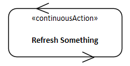

# The ECOMOD Profile Quick Reference

## Profile Elements

### Activities

| Stereotype | Definition | Notation | Example |
|:-----------|:-----------|:--------:|:-------:|
| «continuousActivity» | Represents the activities executed in a _Continuous System Use Case_. |  | |
| «continuousAction» | Represents the Call Behavior Action needed to integrate a _Continuous Activity_ into a workflow. |  |  |

### Actors

| Stereotype | Definition | Notation | Example |
|:-----------|:-----------|:--------:|:-------:|
| «User» | Represents a human actor. It's defined to distinct an user from a _Stakeholder_. |  |  |
| «EnvironmentalEffect» | Represents a relevant effect (e.g. humidity or temperature) from the system's environment that influences the system to be specified. |  |  |
| **_External Devices:_** |  |  |  |
| «Sensor | Represents a foreign device that provides data from the environment to the system to be specified. |  |  |
| «Actuator» | Represents a foreign device that has an effect on the environment and is controlled by the system to be specified. |  |  |
| «ControlUnit» | Represents a foreign device that provides data from the environment to the system to be specified. |  |  |
| «StatusIndicator» | Represents a foreign device that displays status information about the system to be specified. |  |  |
| **_External Systems:_** |  |  |  |
| «ForeignSystem» | Represents a foreign system that receives data from the system to be specified. |  |  |
| «BoundarySystem» | Represents a foreign system that acts as an interface between another system and the system to be specified. |  |  |
| «UserSystem» | Represents a foreign system that acts as an interface between a human and the system to be specified. |  |  |
| «Service» | Represents a foreign system that provides data to the system to be specified. |  |  |

### Blocks

| Stereotype | Definition | Notation | Example |
|:-----------|:-----------|:--------:|:-------:|
| «System» | Represents the system to be specified. |  |  |
| «Context» | Represent a context in which communication links between the context objects are specified. |  |  |

### Use Cases

| Stereotype | Definition | Notation | Example |
|:-----------|:-----------|:--------:|:-------:|
| «SystemUC» | Represents a _System Use Case_ which is equivalent to a mandatory system function. It adds more properties to the SysML UseCase element. |  |  |
| «continuousSUC» | Represents a specialized _System Use Case_ to model continuous behavior. |  |  |
| «SystemProcess» | Represents a behavior of the system that brings the use case activities in a logical execution sequence. |  |  |

### Requirements

| Stereotype | Definition | Notation | Example |
|:-----------|:-----------|:--------:|:-------:|
| «Objective» | Represents a goal that should be achieved through system development. |  |  |
| «Stakeholder» | Represents a person in a specific role or any kind of organization (e.g. a company department or government agency) that has interests, needs, concerns or doubt about the system, or is effected by the system. |  |  |
| **_Functional:_** |  |  |  |
| «FunctionalReqt» | Represents a function of the system under consideration that must be provided by the system or by a system component. |  |  |
| **_Qualities:_** |  |  |  |
| «FunctionalityReqt» | Represents a quality criteria regarding to functionality aspects like capability, reusability, compatibility, interoperability, or portability. |  |  |
| «UsabilityReqt» | Represents a quality criteria regarding to usability aspects like human factors, aesthetics, consistency, documentation, or responsiveness. |  |  |
| «ReliabilityReqt» | Represents a quality criteria regarding to reliability aspects like availability, recoverability, survivability, stability, or accuracy. |  |  |
| «PerformanceReqt» | Represents a quality criteria regarding to the performance aspects like speed, efficiency, resource consumption, throughput, or capacity. |  |  |
| «SupportabilityReqt» | Represents a quality criteria regarding to supportability aspects like maintainability, sustainability, testability, flexibility, installability, or localizability. |  |  |
| «SecurityReqt» | Represents a quality criteria regarding to security aspects like safety, or exploitability. |  |  |
| **_Constraints:_** |  |  |  |
| «TechnologicalReqt» | Represents a technological constraint on the design of system. |  |  |
| «OrganizationallyReqt» | Represents a constraint on the system development process. |  |  |
| «RegulatoryReqt» | Represents a regulatory constraint on the system development. |  |  |

---
# TODO ** TODO ** TODO ** TODO ** TODO ** TODO ** TODO

### Domain Data/Knowledge

| Stereotype | Definition | Notation |
|:-----------|:-----------|:--------:|
| «InformationItem» | Represents an information that is transported either from an actor to the system, or from the system to an actor. |  |

### System Decomposition Elements

| Stereotype | Definition | Notation |
|:-----------|:-----------|:--------:|
| BehavSpecification | Represents the behavior of a building block, especially a software component. |  |
| ControlPoint | Represents an action in a workflow where the measurement of time can be started or stopped. |  |
| HwComponent | Represents a hardware building block the system to be specified is composed of. |  |
| InteractionPoint | Represents an external interface of the system to be specified where it interacts with specific actors. |  |
| SwComponent | Represents a software building block the system to be specified is composed of. |  |

### Software Stack Elements

| Stereotype | Definition | Notation |
|:-----------|:-----------|:--------:|
| SystemLayer | Represents specific level of abstraction within the software architecture that describes the embedding of the system to be specified into its environment.. |  |
| ApplicationLayer | Represents specific level of abstraction within the software architecture that describes the applications provided by the system to be specified. |  |
| DriverLayer| Represents specific level of abstraction within the software architecture that describes which protocols are supported by the system to be specified. |  |
| HwAbstractionLayer | Represents specific level of abstraction within the software architecture that describes how the software components of the **_DriverLayer_** communicate whith the hardware components the system to be specified is composed of. |  |
| HwPlatformLayer | Represents specific level of abstraction within the software architecture that describes which communication technologies are used in the system to be specified. |  |
| InterfaceRepository | Represents, within an abstraction layer, a specific storage location for interface definitions provided or required by the building blocks (_the software components_) that compose the IoT software stack.. |  |
| ImplementationRepository | Represents, within an abstraction layer, a specific storage location for the functional specification of building blocks (_the software components_) used to compose the IoT software stacks. |  |
| DesignRepository | Represents, within an abstraction layer, a specific storage location for the functional application of the building blocks (_the software components_) that compose the IoT software stack. |  |
| ImplementationElement | Represents a software artifact needed for implementation. |  |
| Field | Represents an addressable storage place of a hardware component that is characterized as memory block. | ![Notation of Field]
(images/en-iotpml-field.png) |
| Register | Represents an addressable storage place of a hardware component that is characterized as processing or control unit (but not as memory block). |  |
| Provided Interface | Represents an interface that is offered by a system-internal component. |  |
| Required Interface | Represents an interface that is needed by a system-internal component. |  |
| Behaviour | Represents an interface operation's behavior. |  |

---
_Quick Navigation:_ | [Introduction](index.md) | [Processes](processes.md) | [Methods](methods.md) | [Products](products.md) | [Examples](examples.md) | [Reference](quick-reference.md) | [Glossary](glossary.md) |
