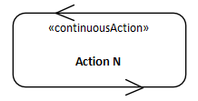
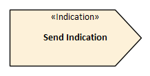
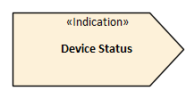
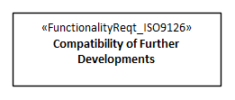
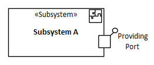
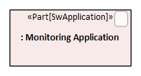

# The ECOMOD Profile Quick Reference

## Profile Elements

### Activities

| Stereotype | Definition | Notation | Example |
|:-----------|:-----------|:--------:|:-------:|
| «continuousAction» | Represents a continuous executed Action. |  |  |
| «continuousActivity» | Represents a continuous running Activity. |  | |
| «continuousEssentialStep» | Represents an essential atomic step in a _Use Case_ workflow that is executed continuous. |  |  |
| «continuousUseCaseActivity» | Represents the workflow executed in a _Continuous Use Case_. |  | |
| «EssentialStep» | Represents an essential atomic step in a _Use Case_ workflow. |  |  |
| «EssentialUCStep» | Represents an essential complex step in a _Use Case_. |  | |
| «SendIndicationAction» | Represents the sending of an indication. |  |  |
| «SendIndicationMessage» | Represents the sending of a message. |  |  |
| «SendIndicationSignal» | Represents the sending of a signal. |  |  |
| «UseCaseActivity» | Represents the workflow executed in a _Use Case_. |  | |

### Actors

| Stereotype | Definition | Notation | Example |
|:-----------|:-----------|:--------:|:-------:|
| «Actuator» | Represents a foreign device that has an effect on the environment and is controlled by the system to be specified. |  |  |
| «BoundarySystem» | Represents a foreign system that acts as an interface between another system and the system to be specified. |  |  |
| «ControlUnit» | Represents a foreign device that provides data from the environment to the system to be specified. |  |  |
| «EnvironmentalEffect» | Represents a relevant effect (e.g. humidity or temperature) from the system's environment that influences the system to be specified. |  |  |
| «ForeignSystem» | Represents a foreign system that receives data from the system to be specified. |  |  |
| «Sensor | Represents a foreign device that provides data from the environment to the system to be specified. |  |  |
| «Service» | Represents a foreign system that provides data to the system to be specified. |  |  |
| «StatusIndicator» | Represents a foreign device that displays status information about the system to be specified. |  |  |
| «User» | Represents a human actor. It's defined to distinct an user from a _Stakeholder_. |  |  |
| «UserSystem» | Represents a foreign system that acts as an interface between a human and the system to be specified. |  |  |

### Behavior

| Stereotype | Definition | Notation | Example |
|:-----------|:-----------|:--------:|:-------:|
| «ProcessBehavior» | Represents the behavior of a process. |  |  |

### Blocks

| Stereotype | Definition | Notation | Example |
|:-----------|:-----------|:--------:|:-------:|
| «Context» | Represent a context in which communication links between the context objects are specified. |  |  |
| «System» | Represents the system to be specified. |  |  |
| «HardwareBlock» | Represents a hardware building block. |  |  |
| «HwSubsystem» | Represents a logical hardware building block. |  |  |
| «SoftwareBlock» | Represents a software building block. |  |  |
| «SwSubsystem» | Represents a logical software building block. |  |  |
| «Subsystem» | Represents a logical building block. |  |  |
| «SwApplication» | Represents a software building block on application layer. |  |  |
| «SwComponent» | Represents a software building block on component layer. |  |  |
| «SwDriver» | Represents a software building block on driver layer. |  |  |

### Interactions

| Stereotype | Definition | Notation | Example |
|:-----------|:-----------|:--------:|:-------:|
| «continuousInteractionOccurence» | Represents a continuous executed interaction. |  | |
| «Lifeline[Hardware]» | Represents the lifeline of a _Hardware Block_ in an interaction. |  | |
| «Lifeline[HwSubsystem]» | Represents the lifeline of a _Hardware Subsystem Block_ in an interaction. |  | |
| «Lifeline[Software]» | Represents the lifeline of a _Software Block_ in an interaction. |  | |
| «Lifeline[Subsystem]» | Represents the lifeline of a _Subsystem Block_ in an interaction. |  | |
| «Lifeline[SwApplication]» | Represents the lifeline of a _Software Application Block_ in an interaction. |  | |
| «Lifeline[SwComponent]» | Represents the lifeline of a _Software Component Block_ in an interaction. |  | |
| «Lifeline[SwDriver]» | Represents the lifeline of a _Software Driver Block_ in an interaction. |  | |
| «Lifeline[SwSubsystem]» | Represents the lifeline of a _Software Subsystem Block_ in an interaction. |  | |
| «ScenarioInteraction» | Represents the interaction of an architecture scenario. |  | |

### Use Cases

| Stereotype | Definition | Notation | Example |
|:-----------|:-----------|:--------:|:-------:|
| «continuous» | Represents a _Use Case_ having continuous behavior. |  |  |
| «primary» | Represents a _Use Case_ which is equivalent to a mandatory system function. |  |  |
| «supporting» | Represents a _Use Case_ which provides a (reuseable) supporting function. |  |  |
| «SystemProcess» | Represents a behavior of the system that brings the use case activities in a logical execution sequence. |  |  |

### Requirements

| Stereotype | Definition | Notation | Example |
|:-----------|:-----------|:--------:|:-------:|
| «Objective» | Represents a goal that should be achieved through system development. |  |  |
| «Stakeholder» | Represents a person in a specific role or any kind of organization (e.g. a company department or government agency) that has interests, needs, concerns or doubt about the system, or is effected by the system. |  |  |
| **_Functional:_** |  |  |  |
| «IndependentSysActivityReqt» | Represents a functional requirement that describes an independent system activity. |  |  |
| «InterfaceInteractionReqt» | Represents a functional requirement that describes an interface interaction. |  |  |
| «UserInteractionReqt» | Represents a functional requirement that describes an user interaction. |  |  |
| **_Qualities (FURPS+):_** |  |  |  |
| «FunctionalityReqt» | [FURPS+] Represents a quality criteria regarding to _Functionality_ aspects like capability, reusability, compatibility, interoperability, or portability. |  |  |
| «UsabilityReqt» | [FURPS+] Represents a quality criteria regarding to _Usability_ aspects like human factors, aesthetics, consistency, documentation, or responsiveness. |  |  |
| «ReliabilityReqt» | [FURPS+] Represents a quality criteria regarding to _Reliability_ aspects like availability, recoverability, survivability, stability, or accuracy. |  |  |
| «PerformanceReqt» | [FURPS+] Represents a quality criteria regarding to the _Performance_ aspects like speed, efficiency, resource consumption, throughput, or capacity. |  |  |
| «SupportabilityReqt» | [FURPS+] Represents a quality criteria regarding to _Supportability_ aspects like maintainability, sustainability, testability, flexibility, installability, or localizability. |  |  |
| «SecurityReqt» | [FURPS+] Represents a quality criteria regarding to _Security_ aspects like safety, or exploitability. |  |  |
| **_Qualities (ISO 9126):_** |  |  |  |
| «EfficiencyReqt_ISO9126» | [ISO 9126] Represents a quality criteria regarding to the _Efficiency_ aspects like speed, efficiency, resource consumption, throughput, or capacity. |  |  |
| «FunctionalityReqt_ISO9126» | [ISO 9126] Represents a quality criteria regarding to _Functionality_ aspects like capability, reusability, compatibility, interoperability, or portability. |  |  |
| «MaintainabilityReqt_ISO9126» | [ISO 9126] Represents a quality criteria regarding to _Maintainability_ aspects like maintainability, sustainability, testability, flexibility, installability, or localizability. |  |  |
| «PortabilityReqt_ISO9126» | [ISO 9126] Represents a quality criteria regarding to _Portability_ aspects like safety, or exploitability. |  |  |
| «ReliabilityReqt_ISO9126» | [ISO 9126] Represents a quality criteria regarding to _Reliability_ aspects like availability, recoverability, survivability, stability, or accuracy. |  |  |
| «UsabilityReqt_ISO9126» | [ISO 9126] Represents a quality criteria regarding to _Usability_ aspects like human factors, aesthetics, consistency, documentation, or responsiveness. |  |  |
| **_Qualities (ISO 25010):_** |  |  |  |
| «QiU_ContextCoverage_ISO25010_» | [ISO 25010] Represents a quality-in-use criteria regarding to _Context Coverage_ aspects. |  |  |
| «QiU_FreedomFromRisk_ISO25010_» | [ISO 25010] Represents a quality-in-use criteria regarding to _Freedom from Risks_ aspects. |  |  |
| «QiU_Satisfaction_ISO25010_» | [ISO 25010] Represents a quality-in-use criteria regarding to _Satisfaction_ aspects. |  |  |
| «QoP_Compability_ISO25010_» | [ISO 25010] Represents a quality-in-use criteria regarding to _Compability_ aspects. |  |  |
| «QoP_FunctionalSuitability_ISO25010_» | [ISO 25010] Represents a quality-in-use criteria regarding to _Functional Suitability_ aspects. |  |  |
| «QoP_Maintainablility_ISO25010_» | [ISO 25010] Represents a quality-in-use criteria regarding to _Maintainablility_ aspects. |  |  |
| «QoP_PerformanceEfficiency_ISO25010_» | [ISO 25010] Represents a quality-in-use criteria regarding to _Performance Efficiency_ aspects. |  |  |
| «QoP_Portability_ISO25010_» | [ISO 25010] Represents a quality-in-use criteria regarding to _Portability_ aspects. |  |  |
| «QoP_Reliability_ISO25010_» | [ISO 25010] Represents a quality-in-use criteria regarding to _Reliability_ aspects. |  |  |
| «QoP_Security_ISO25010_» | [ISO 25010] Represents a quality-in-use criteria regarding to _Security_ aspects. |  |  |
| «QoP_Usability_ISO25010_» | [ISO 25010] Represents a quality-in-use criteria regarding to _Usability_ aspects. |  |  |
| **_Constraints:_** |  |  |  |
| «DeliveryComponentsReqt» | Represents a constraint on other delivery components. |  |  |
| «OrganizationalReqt» | Represents a constraint on the system development process. |  |  |
| «PhysicalReqt» | Represents a physical constraint that restricts the system design. |  |  |
| «RegulatoryReqt» | Represents a regulatory constraint on the system development. |  |  |
| «TechnologicalReqt» | Represents a technological constraint that restricts the system design. |  |  |
| «UserInterfaceReqt» | Represents a user interface constraint that restricts the system design. |  |  |

### Ports

| Stereotype | Definition | Notation | Example |
|:-----------|:-----------|:--------:|:-------:|
| «InteractionPoint» | Represents a specific point over that the system and its environment interacts with its environment. |  |  |
| «ProvidingPort» | Represents ...TODO... |  |  |
| «ReceiverPort» | Represents ...TODO... |  |  |
| «RequiringPort» | Represents ...TODO... |  |  |
| «SenderPort» | Represents ...TODO... |  |  |
| «SwProvidedIntfPort» | Represents ...TODO... |  |  |
| «SwRequiredIntfPort» | Represents ...TODO... |  |  |
| «TypedInteractionPoint» | [electrical] Represents ...TODO... |  |  |
| «TypedInteractionPoint» | [logical] Represents ...TODO... |  |  |
| «TypedInteractionPoint» | [mechanical] Represents ...TODO... |  |  |
| «TypedInteractionPoint» | [service] Represents ...TODO... |  |  |

### Properties

| Stereotype | Definition | Notation | Example |
|:-----------|:-----------|:--------:|:-------:|
| «Part[Hardware]» | Represents the role of a _Hardware Block_ in an internal block view. |  |  |
| «Part[HwSubsystem]» | Represents the role of a _Hardware Subsystem Block_ in an internal block view. |  |  |
| «Part[Software]» | Represents the role of a _Software Block_ in an internal block view. |  |  |
| «Part[Subsystem]» | Represents the role of a _Subsystem Block_ in an internal block view. |  |  |
| «Part[SwApplication]» | Represents the role of a _Software Application Block_ in a composite structure view. |  |  |
| «Part[SwComponent]» | Represents the role of a _Software Component Block_ in a composite structure view. |  |  |
| «Part[SwDriver]» | Represents the role of a _Software Driver Block_ in a composite structure view. |  |  |
| «Part[SwSubsystem]» | Represents the role of a _Software Subsystem Block_ in an internal block view. |  |  |

### Artificial Neural Networks

| Stereotype | Definition | Notation | Example |
|:-----------|:-----------|:--------:|:-------:|
| «ANN Code Profiling» | Represents the profiling features for an static or dynamic analysis of the generated ANN source code. |  |  |
| «ANN Source Code» | Represents the source code generated for the ANN by an AI compiler. |  |  |
| **_Architecture:_** |  |  |  |
| «Asynchronous ANN» | Represents an _Asynchronous ANN_. |  |  |
| «Convolutional ANN» | Represents an _Convolutional ANN_. |  |  |
| «Cyclic ANN» | Represents an _Cyclic ANN_. |  |  |
| «Feedforward ANN» | Represents an _Feedforward ANN_. |  |  |
| «Recurrent ANN» | Represents an _Recurrent ANN_. |  |  |
| «Self-Associative ANN» | Represents an _Self-Associative ANN_. |  |  |
| «Single-Layer ANN» | Represents an _Single-Layer ANN_. |  |  |
| «Symmetric ANN» | Represents an _Symmetric ANN_. |  |  |
| «ActivationLayer» | Represents an _Activation Layer_ of an ANN. |  |  |
| «CombinationLayer» | Represents an _Combination Layer_ of an ANN. |  |  |
| «NormalizationLayer» | Represents an _Normalization Layer_ of an ANN. |  |  |
| «ActivationNeuron» | Represents an _Activation Neuron_ of an ANN. |  |  |
| «CombinationNeuron» | Represents an _Combination Neuron_ of an ANN. |  |  |
| «NormalizationNeuron» | Represents an _Normalization Neuron_ of an ANN. |  |  |
| **_Machine Learning:_** |  |  |  |
| «ML Classification» | Represents the supervised machine learning (ML) method _Classification_. |  |  |
| «ML Clustering» | Represents the unsupervised machine learning (ML) method _Clustering_. |  |  |
| «ML Decision-Making» | Represents the reinforcement machine learning (ML) method _Decision-Making_. |  |  |
| «ML Regression» | Represents the supervised machine learning (ML) method _Regression_. |  |  |
| «ML Process» | Represents the workflow of the machine learning (ML) procedure. |  |  |
| «ML Test Dataset» | Represents the structural description of a dataset used to test the ANN. |  |  |
| «ML Training Dataset» | Represents the structural description of a dataset used to train the ANN. |  |  |
| «ML Validation Dataset» | Represents the structural description of a dataset used to validate the ANN. |  |  |
| «ML Test Database» | Represents the concrete database of the test data. |  |  |
| «ML Training Database» | Represents the concrete database of the training data. |  |  |
| «ML Validation Database» | Represents the concrete database of the validation data. |  |  |

---
_Quick Navigation:_ | [Introduction](index.md) | [Processes](processes.md) | [Methods](methods.md) | [Products](products.md) | [Examples](examples.md) | [Reference](quick-reference.md) | [Glossary](glossary.md) |
