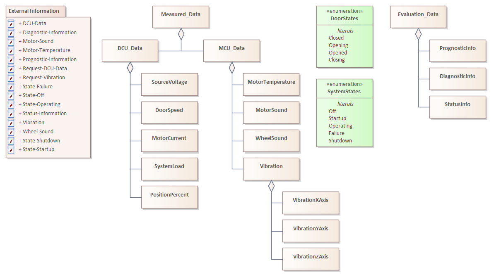

# ECOMOD Task: Model Domain Information Items

!!TODO!!

## Description

### Motivation

!!TODO!!

### What's To Do

!!TODO!!

#### Guiding Questions

+ !!TODO!!

### How To Do

!!TODO!!

#### Used Model Objects

+ Views: `UML Class Diagram`
+ Elements: `UML Class`, `UML Signal`, `UML Enumeration`
+ Relationships: `UML Association`, `UML Aggregation`, `UML Composition`, `UML Dependency`

### Next Steps

!!TODO!!

## Inputs

!!TODO!!

## Outputs

!!TODO!!

## Recommendations & Tips

_None._

## Modeling Guidance

How to model the _Domain Data Model_ in the Enterprise Architect tool:

1. !!TODO!!

## Examples

### Domain Data Model

### Model Content

---
_Quick Navigation:_ | [Introduction](index.md) | [Processes](processes.md) | [Methods](methods.md) | [Products](products.md) | [Examples](examples.md) | [Reference](quick-reference.md) | [Glossary](glossary.md) |
