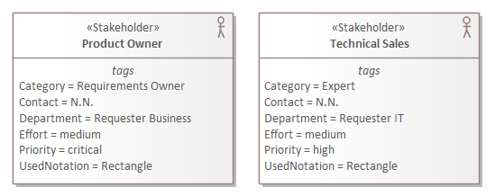
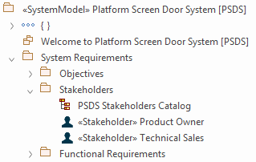

# ECOMOD Task: Model Stakeholders

_Quick Navigation:_ | [Introduction](index.md) | [Processes](processes.md) | [Methods](methods.md) | [Products](products.md) | [Examples](examples.md) | [Reference](quick-reference.md) | [Glossary](glossary.md) |

---

Capture all persons and organizations that are interested in or effected by the system.

## Description

### Motivation

The _Stakeholders_ are used to trace the source of the _Requirements_.

### What's To Do

Identify all persons and organizations that are interested in or effected by the system. This can be done initially in a workshop and continually reworked during the development process (normally, more _Stakeholders_ will be identified in later steps of the progressive development process).

For each _Stakeholder_ document the designation, a contact person and the concerns of the _Stakeholder_. To be able to get in touch we also store a contact information (e-mail, phone, availability, ...). To priorize the typically very long list of _Stakeholders_ we classify the priority and the effort to consider the _Stakeholder_ (to enable a 2-dimensional priorization). Additionally we classify the _Stakeholder_ by a category and by the area interests the _Stakeholder_ represents.

#### Guiding Questions

+ Who is interested in the system?
+ Who is effected by the system?
+ Who is using the system?

### How To Do

To represent a _Stakeholder_ in the system model the ECOMOD profile provides the **ECOMOD stereotype «Stakeholder»**, which is a specialization of the **SysML Stakeholder** with extended properties.

Each identified _Stakeholder_ will be pictured by an **ECOMOD stereotype «Stakeholder»** in the `Stakeholders` package.
If sensible, create a **SysML Trace** relationship from this element to those [_System Objectives_](product_system-objectives.md) this _Stakeholder_ supports or is interested in.

Additionally this element can be depicted in the `Stakeholder Catalog` diagram.

#### Used Model Objects

+ Views: `SysML Requirements Diagram`
+ Elements: `ECOMOD stereotype «Stakeholder»`
+ Relationships: `SysML Trace`

### Next Steps

Describe, from the perspective of the _Stakeholders_, all the functional and non-functional properties (quality criterias, constraints) that have to be satisfied by the system as [_Requirements_](product_requirements.md).

## Inputs

+ _-none-_

## Outputs

+ [Stakeholders](product_stakeholders.md)

## Recommendations & Tips

_None._

## Modeling Guidance

How to model the _Stakeholders_ in the Enterprise Architect tool:

1. If not active, enable the `ECOMOD System Modeling` perspective.

2. Switch to the [Project Browser] view.

3. Locate your system model root package.

4. Locate the `Stakeholders` subpackage within the `System Requirements` package.

5. Open the `Stakeholders Catalog` diagram.

6. In the [Toolbox] view, ensure that content of the `ECOMOD System Requirements` toolbox (part of the `ECOMOD System-Level` toolbox set) is visible. 

8. Repeat the steps below for each identified _System Objective_:
    + Create a new `ECOMOD stereotype «Stakeholder»` element with a proper name within the `Stakeholders` package by drag and drop the toolbox entry `Stakeholder` onto the opened diagram.
    + Capture all relevant properties of this element.
    + If sensible, model a `SysML Trace` relationship from this element to a _System Objective_ if this is a goal/concern of that stakeholder.

### Examples

#### Stakeholders

#### Model Content

---
_Quick Navigation:_ | [Introduction](index.md) | [Processes](processes.md) | [Methods](methods.md) | [Products](products.md) | [Examples](examples.md) | [Reference](quick-reference.md) | [Glossary](glossary.md) |
