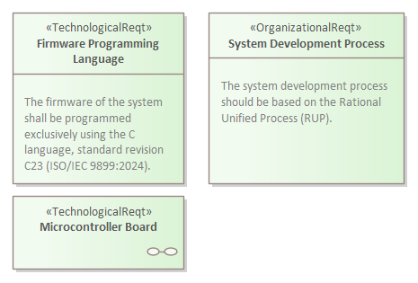
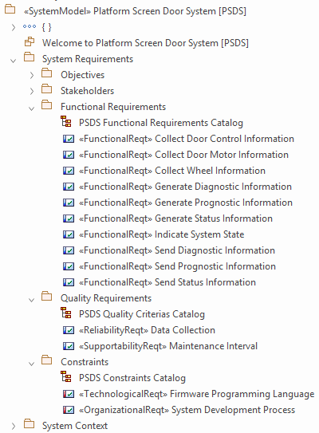

# ECOMOD Task: Determine System Constraints

_Quick Navigation:_ | [Introduction](index.md) | [Processes](processes.md) | [Methods](methods.md) | [Products](products.md) | [Examples](examples.md) | [Reference](quick-reference.md) | [Glossary](glossary.md) |

---

Capture the functional systemrequirements of the system.

## Description

### Motivation

It's important to know the limitations of the solution space and the guidelines for the development process.

### What's To Do

Describe the constraints that limit the solution space, must be satisfied by the system, and influences the development process, and add them to the system model.

#### Guiding Questions

+ What are the constraints that limit the solution space?
+ Which technological or physical constraints must be satisfied by the system?
+ Which organizational constraints must be taken into account while system development?
+ Which regulatory constraints limit the solution space?
+ Am I asking the right person and asking the right questions?
+ Are the answers official?
+ Is the stakeholder's concern a request or just a wish?
+ How can you check whether the requirement is met by the system?

### How To Do

To represent a _System Quality_ in the system model the ECOMOD profile provides various stereotypes, which are specializations of the **SysML Requirement** with extended properties.

Each identified _System Quality_ will be pictured in the `Constraints` package using one of the following variants: **ECOMOD stereotype «TechnologicalReqt»**, **ECOMOD stereotype «OrganizationalReqt»**, ***ECOMOD stereotype «RegulatoryReqt»***. Additionally the created element can be depicted in the `Constraints Catalog` diagram.

#### Used Model Objects

+ Views: `SysML Requirements Diagram`
+ Elements: `ECOMOD stereotype «TechnologicalReqt»`, `ECOMOD stereotype «OrganizationalReqt»`, `ECOMOD stereotype «RegulatoryReqt»`
+ Relationships: `SysML Trace`

## Inputs

+ _-none-_

## Outputs

+ [System Requirements](product_system-requirements.md), extended by:
  - System Constraints

## Recommendations & Tips

_None._

## Modeling Guidance

How to model the _System Constraints_ in the Enterprise Architect tool:

1. If not active, enable the `ECOMOD System Modeling` perspective.

2. Switch to the [Project Browser] view.

3. Locate your system model root package.

4. Locate the `Constraints` subpackage within the `System Requirements` package.

5. Open the `Constraints Catalog` diagram.

6. In the [Toolbox] view, ensure that content of the `ECOMOD System Requirements` toolbox (part of the `ECOMOD System-Level` toolbox set) is visible. 

8. Repeat the steps below for each identified _System Constraints_:
    + Create a new _System Constraint_ element with a proper name within the `Constraints` package by drag and drop one of the following toolbox entries onto the opened diagram: `Constraint: Technological`, `Constraint: Organizational`, `Constraint: Regulatory`.
    + Assign a _Stakeholder_ by using the "**Stakeholder**" property of this element.
    + Capture all other properties of this element.
    + If sensible, model a `SysML Trace` relationship from this element to each _System Objective_ supported by this requirement.

### Examples

#### System Constraints

#### Model Content

---
_Quick Navigation:_ | [Introduction](index.md) | [Processes](processes.md) | [Methods](methods.md) | [Products](products.md) | [Examples](examples.md) | [Reference](quick-reference.md) | [Glossary](glossary.md) |
