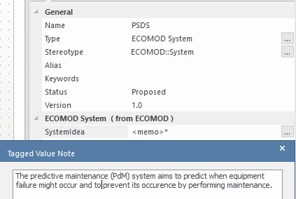
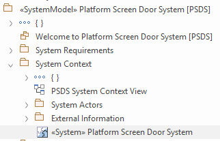

# ECOMOD Task: Model System Idea

_Quick Navigation:_ | [Introduction](index.md) | [Processes](processes.md) | [Methods](methods.md) | [Products](products.md) | [Examples](examples.md) | [Reference](quick-reference.md) | [Glossary](glossary.md) |

---

Capture the core idea behind the system and lists the core feature of the system.

## Description

### Motivation

The [_System Idea_](product_system-idea.md) is part of the basic knowledge for all subsequent steps and have to be communicated to everyone who is involved in the system development.

### What's To Do

Capture a brief description (_in 1-3 sentences_) of the purpose of the system.

#### Guiding Questions

+ What we are building?
+ Why we are doing this?
+ What is the value for the user of the system?

### How To Do

Look for the element representing the system of interest (`ECOMOD stereotype «System»`) in the `System Context` package. Select its `SystemIdea` property and fill in the text describing the purpose of the system.

#### Used Model Objects

+ Views: _-none-_
+ Elements: `ECOMOD stereotype «System»`
+ Relationships: _-none-_

### Next Steps

Describe the goals of the owner of the system.

## Inputs

+ _-none-_

## Outputs

+ [System Idea](product_system-idea.md)

## Recommendations & Tips

_None._

## Modeling Guidance

How to model the _System Idea_ in the Enterprise Architect tool:

1. Switch to the [Project Browser] view.

2. Locate your system model root package.

3. Locate the `System Context` package.

4. Select the element having the `ECOMOD stereotype «System»` set.

5. Open the [Properties] view for the selected element.

6. Save the text describing the _System Idea_ in the `SystemIdea` property.

## Examples

### System Idea

### Model Content

---
_Quick Navigation:_ | [Introduction](index.md) | [Processes](processes.md) | [Methods](methods.md) | [Products](products.md) | [Examples](examples.md) | [Reference](quick-reference.md) | [Glossary](glossary.md) |
