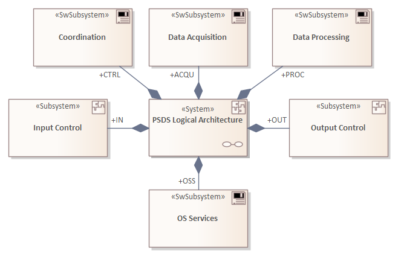

# ECOMOD Task: Model System Architecture Decomposition

!!TODO!!
Identify the building blocks that make up the system.

## Description

### Motivation

!!TODO!!
The system structures are the static building blocks of the (logical) system architecture.

### What's To Do

!!TODO!!
Model the system building blocks and their relationships at a level of detail necessary for the overall system to meet the project requirements.

#### Guiding Questions

!!TODO!!
+ Which building blocks are needed to implement the requested functionality?
+ How is a building block constructed?
+ How is a building block composed of?

### How To Do

!!TODO!!
For each requested functionality, determine the necessary building blocks and structures and display them in an overview diagram.

#### Used Model Objects

!!TODO!!
+ Views: `IoT-PML System Decomposition Diagram`
+ Elements: `IoT-PML stereotype «system»`, `IoT-PML stereotype «hwComponent»`, `IoT-PML stereotype «swComponent»`
+ Relationships: `IoT-PML stereotype «Comprise»`

### Next Steps

!!TODO!!
The building blocks of the (logical) architecture describe generic concepts and principles and can be easily reused.

## Inputs

!!TODO!!
+ [Functional Requirements](product_functional-requirements.md)
+ [System Architecture](product_system-architecture.md)

## Outputs

!!TODO!!
+ [System Architecture](product_system-architecture.md) _enriched with:_
  - System Composition View, System Component Catalog

## Recommendations & Tips

_None._

## Modeling Guidance

How to model the _System Architecture Decomposition_ in the Enterprise Architect tool:

1. !!TODO!!

## Examples

### System Architecture Decomposition

### Model Content

---
_Quick Navigation:_ | [Introduction](index.md) | [Processes](processes.md) | [Methods](methods.md) | [Products](products.md) | [Examples](examples.md) | [Reference](quick-reference.md) | [Glossary](glossary.md) |
