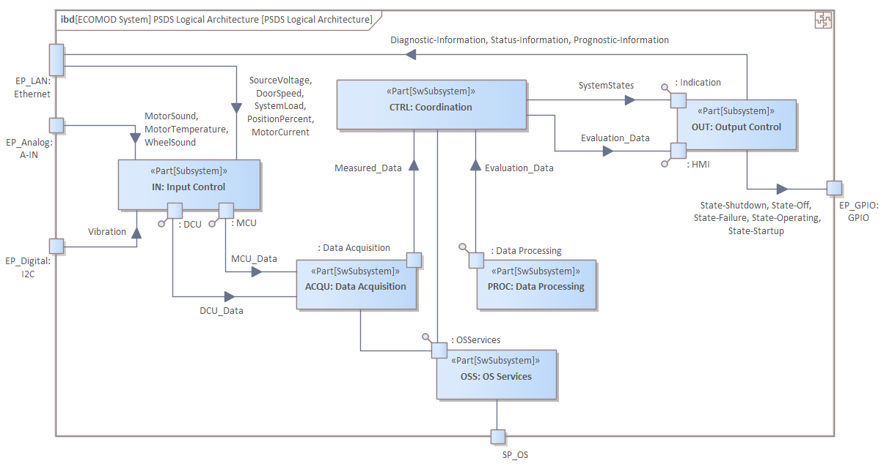

# ECOMOD Task: Model Internal Information Flows

!!TODO!!
Describe the flow of information between the interfaces of the system building blocks.

## Description

### Motivation

!!TODO!!
For a clear understanding of the system architecture, the information flow between the system components is helpful.

### What's To Do

!!TODO!!
Describe the information items that the system components exchange among themselves.

#### Guiding Questions

!!TODO!!
+ What information is exchanged between the blocks?
+ What information is required by a block?
+ What information can a building block provide?

### How To Do

!!TODO!!
For each identified system component, the relevant information items that it send to or receive from other components are noted.

#### Used Model Objects

!!TODO!!
+ Views: `IoT-PML System Decomposition Diagram`
+ Elements: `IoT-PML stereotype «hwComponent»`, `IoT-PML stereotype «swComponent»`, `IoT-PML stereotype «Interaction Point»`, `IoT-PML InformationItem`
+ Relationships: `UML InformationFlow`

### Next Steps

!!TODO!!
In the design, the information flows are used to describe the component interfaces. The system architecture must reflect the information flows inside the system.

## Inputs

!!TODO!!
+ [System Architecture](product_system-architecture.md)

## Outputs

!!TODO!!
+ [System Architecture](product_system-architecture.md) _enriched with:_
  - Component Interfaces View, Internal Information Catalog, Internal Information Flows

## Recommendations & Tips

_None._

## Modeling Guidance

How to model the _System Internal Information Flows_ in the Enterprise Architect tool:

1. !!TODO!!

## Examples

### System Internal Information Flows

---
_Quick Navigation:_ | [Introduction](index.md) | [Processes](processes.md) | [Methods](methods.md) | [Products](products.md) | [Examples](examples.md) | [Reference](quick-reference.md) | [Glossary](glossary.md) |
