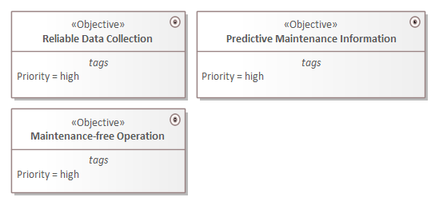
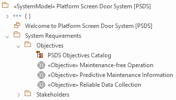

# ECOMOD Task: Model System Objectives

_Quick Navigation:_ | [Introduction](index.md) | [Processes](processes.md) | [Methods](methods.md) | [Products](products.md) | [Examples](examples.md) | [Reference](quick-reference.md) | [Glossary](glossary.md) |

---

Capture the goals of the owner of the system.

## Description

### Motivation

The _System Objectives_ are used to trace the rationale of the _Requirements_ and to communicate the goals of the system development to the persons that are building the system model to ensure that they made the right decisions on the way to the finished system.

### What's To Do

Describe goals of the system development in a short and readable form, and add them to the system model.

#### Guiding Questions

+ What are the goals of the system development?
+ What goals does the project *not* pursue, what are the so-called non-goals?
+ What is the value for the user of the system?

### How To Do

A _System Objective_ is a specific kind of requirement. To represent a _System Objective_ in the system model the ECOMOD profile provides the **ECOMOD stereotype «Objective»**, which is a specialization of the **SysML Requirement** with extended properties.

Each identified _System Objective_ will be pictured by an **ECOMOD stereotype «Objective»** in the `Objectives` package. Additionally the created element can be depicted in the `Objectives Catalog` diagram.

#### Used Model Objects

+ Views: `SysML Requirements Diagram`
+ Elements: `ECOMOD stereotype «Objective»`
+ Relationships: _-none-_

### Next Steps

The _System Objectives_ are part of the basic knowledge for all subsequent steps and have to be communicated to everyone who is involved in the system development.

## Inputs

+ _-none-_

## Outputs

+ [System Objectives](product_system-objectives.md)

## Recommendations & Tips

_None._

## Modeling Guidance

How to model the _System Objectives_ in the Enterprise Architect tool:

1. If not active, enable the `ECOMOD System Modeling` perspective.

2. Switch to the [Project Browser] view.

3. Locate your system model root package.

4. Locate the `Objectives` subpackage within the `System Requirements` package.

5. Open the `Objectives Catalog` diagram.

6. In the [Toolbox] view, ensure that content of the `ECOMOD System Requirements` toolbox (part of the `ECOMOD System-Level` toolbox set) is visible. 

7. Repeat the steps below for each identified _System Objective_:
    + Create a new `ECOMOD stereotype «Objective»` element with a proper name within the `Objectives` package by drag and drop the toolbox entry `Objective` onto the opened diagram.
    + Capture all relevant properties of this element.

### Examples

#### System Objectives

#### Model Content

---
_Quick Navigation:_ | [Introduction](index.md) | [Processes](processes.md) | [Methods](methods.md) | [Products](products.md) | [Examples](examples.md) | [Reference](quick-reference.md) | [Glossary](glossary.md) |
