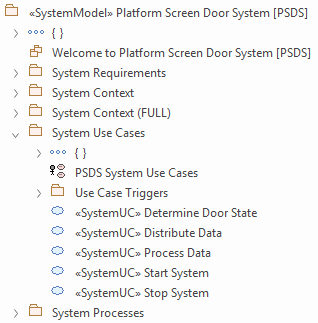

# ECOMOD Task: Identify Use Cases

The use cases are the services and the essential ends of a system. The system is developed and operated to archieve these services.

## Description

### Motivation

The use cases describe the system's services that are perceived and requested from the outside.

### What's To Do

The use cases are identified and assigned to the system actors involved.

#### Guiding Questions

+ What can the system do for the individual actor?
+ What information is at the beginning of a process?
+ What events do the services deliver to the actors?

### How To Do

The use cases are systematically developed based on the requirements and the system context.

#### Used Model Objects

+ Views: `UML UseCase Diagram`
+ Elements: `UML UseCase`, `IoT-PML actor stereotypes`
+ Relationships: `UML Association`, `UML Inclusion`

### Next Steps

The use cases are provided with a process description and serve as a starting point for deriving the system architecture.

## Inputs

+ !!TODO!!

## Outputs

+ !!TODO!!

## Recommendations & Tips

_None._

## Modeling Guidance

How to model the _System Use Cases_ in the Enterprise Architect tool:

1. !!TODO!!

## Examples

### System Use Cases

### Model Content

---
_Quick Navigation:_ | [Introduction](index.md) | [Processes](processes.md) | [Methods](methods.md) | [Products](products.md) | [Examples](examples.md) | [Reference](quick-reference.md) | [Glossary](glossary.md) |
